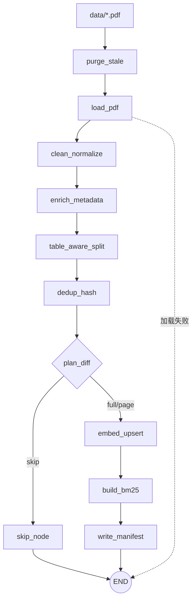
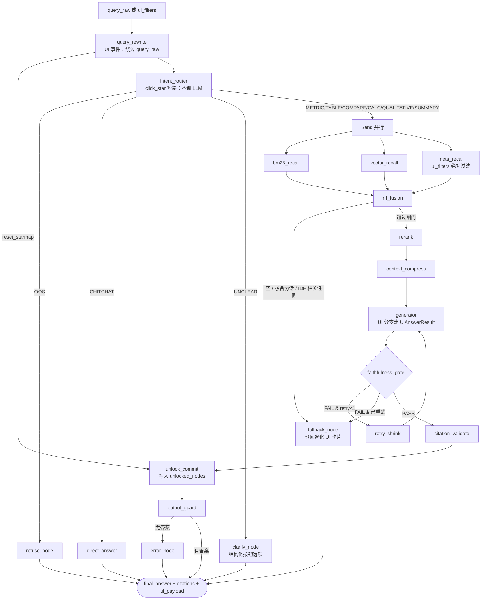

# 架构设计

## 1. 从 `test_loader.py` 到 RAG 图：演进路径

最初的骨架只有一条数据流（`test_loader.py`，已验证可跑，118 页）：

```python
loader = PyPDFLoader("./data/sample_report.pdf")
pages = loader.load()
print(len(pages), pages[0].page_content[:200])
```

```
PDF --PyPDFLoader--> pages --print
```

它回答了"能不能摸到数据"。要变成问答助手，需要补三件事：

1. **离线把 pages 变成可检索的索引**（入库子图）
2. **在线把问题变成可检索的查询，再把片段变成有引用的答案**（问答主图）
3. **任何一环失败都不能静默**（容错 + 兜底）

中间产物是 v0 骨架 `src/vc/graph/skeleton_graph.py`（保留，可运行）：

```
router -> (retriever -> generator | guardrail) -> END
```

它已经具备 LangGraph 的三个核心概念：**State（黑板）/ Node（动作）/ Conditional Edge（分流）**。
v1 的问答主图就是在这四个节点上生长出来的：`retriever` 膨胀为三路召回 + 融合 + 重排，
`generator` 前面加上下文压缩、后面加数值闸门与引用校验，`guardrail` 拆成意图路由 + 越界拒答 + 合规收口，
再补上贯穿全图的 `errors / degraded / trace` 三条横切通道。

## 2. 全景图

```mermaid
flowchart LR
    subgraph OFFLINE["离线 · 入库子图 (ingest_graph.py)"]
        direction TB
        A["data/*.pdf + 同名 .meta.json"] --> B["purge_stale<br/>失效文档清理"]
        B --> C["load_pdf<br/>PyPDFLoader 按页加载"]
        C --> D["clean_normalize<br/>页眉页脚/页码/水印/符号字体清洗"]
        D --> E["enrich_metadata<br/>sidecar 优先 + 首页正则兜底<br/>公司·代码·期间·行业"]
        E --> F["table_aware_split<br/>表格整块 + 正文滑窗"]
        F --> G["dedup_hash<br/>file_sha256 + page_hash"]
        G --> H{"plan_diff<br/>增量决策"}
        H -->|"未变更"| I["skip_node"]
        H -->|"新增/变更"| J["embed_upsert<br/>临时去重 + 写入向量库"]
        J --> K["build_bm25<br/>按快照重建倒排"]
        K --> L["write_manifest<br/>校验后原子替换"]
    end

    subgraph INDEX["索引快照"]
        M[("Chroma / Pickle<br/>向量库")]
        N[("bm25.pkl<br/>倒排索引")]
        O[("manifest.json<br/>版本与指纹")]
    end

    L --> M
    L --> N
    L --> O

    subgraph ONLINE["在线 · 问答主图 (query_graph.py)"]
        direction TB
        Q["用户提问"] --> R["query_rewrite<br/>指代消解 + 同义扩展"]
        R --> S["intent_router<br/>规则打分路由"]
        S -->|"OOS"| T["refuse_node"]
        S -->|"CHITCHAT"| U["direct_answer"]
        S -->|"UNCLEAR"| V["clarify_node"]
        S -->|"其余意图"| W["Send 并行三路召回"]
        W --> W1["bm25_recall"]
        W --> W2["vector_recall"]
        W --> W3["meta_recall"]
        W1 --> X["rrf_fusion<br/>加权 RRF + 相关性闸门"]
        W2 --> X
        W3 --> X
        X -->|"无结果/低相关"| Y["fallback_node"]
        X -->|"通过"| Z["rerank → context_compress"]
        Z --> AA["generator"]
        AA --> AB{"faithfulness_gate<br/>数值一致性"}
        AB -->|"不通过 且 未重试"| AC["retry_shrink"] --> AA
        AB -->|"不通过 且 已重试"| Y
        AB -->|"通过"| AD["citation_validate"]
        AD --> AE["output_guard<br/>免责 + 无来源数字拦截"]
        AE --> AF{"有答案?"}
        AF -->|"否"| AG["error_node"]
        AF -->|"是"| AH["最终答案"]
    end

    M --> W2
    N --> W1
    N --> W3
    O --> R
```



## 3. 入库子图（离线）



要点：
- 入库与在线**彻底解耦**：在线只读 `manifest.json` + `bm25.pkl` + 向量库快照，入库失败不影响在线可用性；
- `write_manifest` 在写盘前会校验 `store.count() > 0`，校验不通过就抛错保留旧版本；
- 切换 embedding provider（维度变化）会被 `plan_diff` 识别为 `full` 强制全量重建；
- 多文档语料（60 份财报）走 `scripts/ingest_corpus.py`：逐文档传 `skip_bm25=True`
  跳过倒排重建，末尾 `rebuild_bm25()` 统一重建一次，避免 O(n²) 的快照 IO。

## 4. 问答主图（在线）

两条入口共用同一条主干：**自然语言**（`ui_action=natural_query`）与**富交互事件**（`ui_action=click_star` / `clarify_followup`）。
后者在 `query_rewrite` 与 `intent_router` 处双短路——结构化事件不需要改写与意图猜测，也不依赖非空的 `query_raw`。



### 4.1 富交互（知识星图）通道

| 关注点 | 落点 |
| --- | --- |
| 事件清洗与星图映射 | `src/vc/ui.py`（白名单 `clean_ui_filters` + `STAR_NODES` 节点表，纯函数无 IO） |
| 状态字段 | `ui_action` / `ui_filters` / `star_node_id` / `filters_strict` / `ui_payload` / `unlocked_nodes` |
| 结构化输出契约 | `schema.py::UiAnswerResult`（`explanation`≤100 字 / `citations` / `unlock_next`） |
| 多轮记忆 | `compile(checkpointer=...)`，`MemorySaver` 默认、`VC_CHECKPOINT=sqlite` 走 `SqliteSaver` |
| 会话隔离 | `ask(..., thread_id=...)`；同一 thread_id 下 `unlocked_nodes` 跨 invoke 累加，**不同 thread 互不影响** |

要点：

1. **点亮只写"已点亮"**：`unlock_next` 是推荐候选，留在 `ui_payload` 里由前端决定，不冒充已点亮；
2. **引用不通过不点亮**：`unlock_commit` 挂在 `citation_validate` 之后，走 fallback 的路径不会写入 `unlocked_nodes`；
3. **UI 分支不绕过护栏**：`answer` 仍写文本（= explanation + 角标），`faithfulness_gate` / `citation_validate` / `output_guard` 零改动继续生效；
4. **UI 永不空屏**：generator 与 `fallback_node` 在 UI 事件下都必须产出 `ui_payload`，失败时给退化卡片。

## 5. ASCII 简图（终端可读）

```
[data/sample_report.pdf]
  -> purge_stale -> load_pdf -> clean_normalize -> enrich_metadata
  -> table_aware_split -> dedup_hash -> plan_diff -+
                                                  |-> skip_node
                                                  +-> embed_upsert -> build_bm25 -> write_manifest
                                                              |
                        +-------------------+-----------------+
                        v                   v                 v
                  [向量库 chroma]     [bm25.pkl]        [manifest.json]
                        |                   |                 |
[问题] -> query_rewrite -> intent_router -+-> OOS/CHITCHAT/UNCLEAR -> 短路输出
                                          |
                                          +-> Send 并行 ┌ bm25_recall ┐
                                                        ├ vector_recall┤-> rrf_fusion
                                                        └ meta_recall  ┘      |
                                                                              v
                      fallback_node <--(空/低分/低相关)--+            rerank -> compress
                             ^                                              |
                             |                                        generator
                             |                                              |
                             +--(数值不通过 且 已重试)-------- faithfulness_gate
                                                                            |通过
                                                            citation_validate -> output_guard -> 答案+引用
                                                                                      |
                                                                                 (无答案) -> error_node
```

## 6. 横切通道（贯穿所有节点）

| 通道 | 类型 | 语义 | 谁写 | 谁读 |
| --- | --- | --- | --- | --- |
| `errors` | `Annotated[List[ErrorItem], add_list]` | 只增不减的错误流水 | `safe_node` / 节点内 `make_error` | `fallback_node`（判定兜底原因）、`error_node`、`/trace` |
| `degraded` | `Annotated[List[str], add_list]` | 已启用的降级项 | `safe_node` / `generator` | 前端提示、评测报告 |
| `trace` | `Annotated[List[dict], add_list]` | 节点耗时与成败 | `safe_node` | API `/ask`、`/trace`、Streamlit 面板 |
| `unlocked_nodes` | `Annotated[List[str], merge_unique]` | 已点亮星图节点，去重累加 | `unlock_commit` | 前端星图、`unlock_next` 推荐排除项 |

**关键约束**：错误只写 `errors`，绝不覆盖 `answer / context / fused` 等主字段。
主字段失败时置空或保留上一次成功值，由条件边决定走降级还是兜底。

**回合窗口**：注入 Checkpointer 后，同一 thread_id 下 `errors` / `trace` 会跨轮累积。
`query_rewrite` 作为每轮第一个节点返回 `RESET_LIST` 哨兵，由 reducer 过滤后实现"本轮重新计数"——
语义仍是只增不减，只是把窗口从整个会话收敛到当前轮次（`unlocked_nodes` 不受影响，它要的就是跨轮累加）。

## 7. 目录与真源

| 关注点 | 代码真源 | 文档真源 |
| --- | --- | --- |
| 图结构 | `src/vc/graph/query_graph.py`、`ingest_graph.py` | 本文 |
| 节点规格 | `src/vc/graph/nodes/*` | `docs/design/nodes.md` |
| LLM 契约层 | `src/vc/schema.py`、`src/vc/prompts/*`、`providers/llm.py::generate_json` | `docs/design/nodes.md` 第四节 |
| 评测层 | `src/vc/eval/*`、`scripts/sweep.py`、`scripts/fetch_cfqa.py` | `docs/dev/testing.md`、`docs/dev/tuning.md` |
| 检索细则 | `src/vc/retrieval/*`、`src/vc/ingestion/splitter.py` | `docs/design/retrieval.md` |
| 知识更新 | `src/vc/ingestion/manifest.py`、`snapshot.py` | `docs/design/knowledge_update.md` |
| 错误码 | `src/vc/errors.py` | `docs/design/error_handling.md` |

三者必须同 PR 更新（见 `docs/adrs/ADR-0005-文档与代码同PR更新.md`）。
