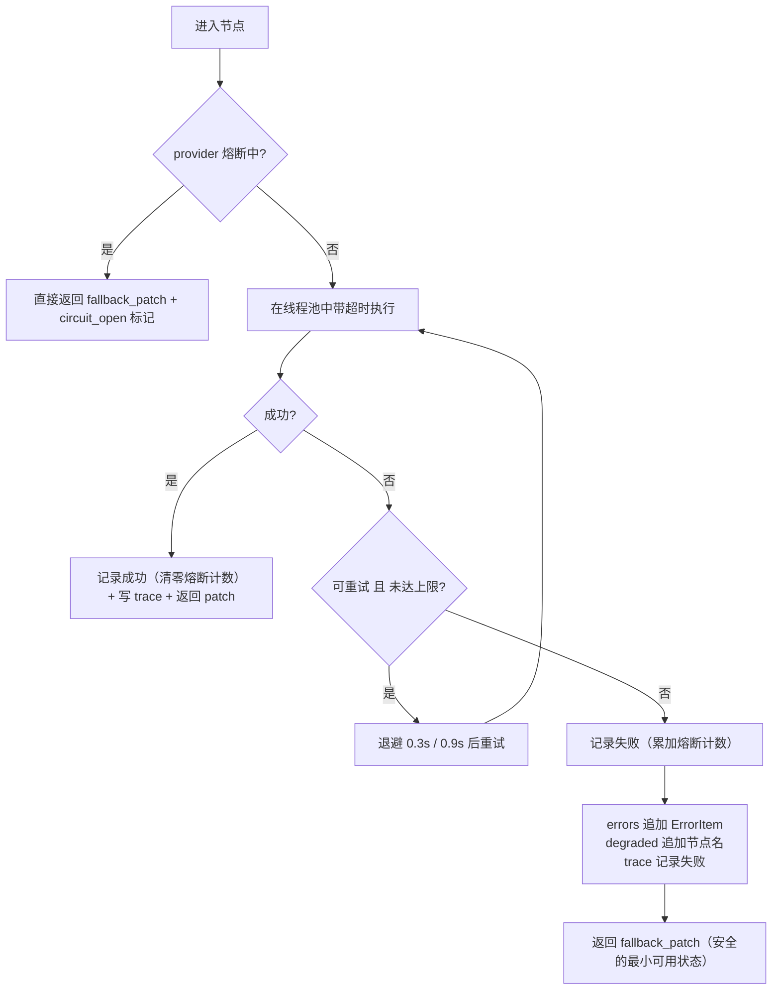

# 报错管理细则

## 1. 三大原则

1. **错误码收敛**：所有错误走 `ErrorCode` 枚举（`src/vc/errors.py`），禁止节点自定义裸字符串；
2. **错误只累加，不覆盖**：`state["errors"]` 使用 `add_list` reducer，节点失败时**绝不**覆盖 `answer / context / fused`；
3. **节点永不炸图**：所有节点被 `safe_node` 包裹，异常统一转成 `ErrorItem`，由条件边决定降级还是兜底。

## 2. 错误码表

| 码 | 节点 | 严重级 | 可重试 | 含义 | 典型兜底 |
| --- | --- | --- | --- | --- | --- |
| `E_LOAD` | load_pdf | fatal | 否 | 文件缺失/加密/损坏 | 终止入库，不写 manifest |
| `E_SPLIT` | table_aware_split | error | 否 | 切分失败 | 回退按页切分 |
| `E_EMBED` | embed_upsert | error | 是 | embedding 服务异常 | 重试 → 回落 Hashing |
| `E_STORE_UPSERT` | embed_upsert | fatal | 否 | 向量库写入失败 | 保留旧索引 |
| `E_MANIFEST_WRITE` | write_manifest | error | 否 | manifest 写入失败 | 保留旧版本 |
| `E_BM25` | bm25_recall | warn | 否 | 索引缺失或异常 | 依赖其它两路 |
| `E_STORE_QUERY` | vector_recall | warn | 是 | 向量库查询超时/不可用 | 降级为 BM25 + meta |
| `E_META_FILTER` | metadata_recall | warn | 否 | 元数据过滤异常 | 忽略该路 |
| `E_EMPTY_RECALL` | rrf_fusion | warn | 否 | 三路均无结果 | 兜底话术（未检索到） |
| `E_LOW_SCORE` | rrf_fusion | warn | 否 | 融合分或相关性过低 | 兜底 + 原文摘录 |
| `E_RERANK` | rerank | warn | 否 | 重排失败 | 用 RRF 顺序 |
| `E_LLM_TIMEOUT` | generator | error | 是 | 模型超时 | 重试 → MockLLM → 摘录兜底 |
| `E_LLM_RATE_LIMIT` | generator | error | 是 | 限流 | 退避重试 → 摘录兜底 |
| `E_LLM_BADJSON` | generator / router / gate | error | 否 | 返回无法解析或不符合 Schema | 先带错误信息修复重试 1 次（`LLM_JSON_REPAIR`），仍失败 → 回落确定性逻辑 → 摘录兜底 |
| `E_NUM_MISMATCH` | faithfulness_gate | error | 否 | 答案数字不在原文 | 收紧重试 1 次 → 兜底 |
| `E_CITATION_MISS` | gate / validate | warn | 否 | 引用页码不可溯源；或答案含数字却抽不出任何引用（抽取口径见 `nodes.md` 2.1：仅认 `[P12]` 角标与「来源：P12」变体） | 剥离引用；无引用且含数字 → `output_guard` 转摘录兜底 |
| `E_INTENT_UNCLEAR` | router | warn | 否 | 意图不明 | 追问澄清 |
| `E_OOS` | router | warn | 否 | 越界问题 | 合规拒答 |
| `E_TIMEOUT` | 任意节点 | warn | 是 | 节点超时 | 该节点降级 |
| `E_INTERNAL` | 任意节点 | error | 否 | 未分类异常 | 通用兜底 |

## 3. `safe_node`：统一的容错包装

```python
@safe_node("bm25_recall", timeout=3.0, provider="bm25", fallback_patch={"recall_bm25": []})
def bm25_recall(state): ...
```

执行顺序：



要点：

- **超时实现**：`ThreadPoolExecutor` + `future.result(timeout)`，跨平台、无需信号；
  注意超时后线程仍在后台跑完，因此节点内不应持有不可重入的全局锁；
- **退避**：`0.3 * 3^(n-1)` → 0.3s、0.9s，最多 `MAX_RETRY=2` 次；
- **熔断**：同一 provider 连续失败 `CIRCUIT_THRESHOLD=3` 次后，`CIRCUIT_TTL=60s` 内直接短路；
- **返回值校验**：节点返回非 `dict` 会被转成 `E_INTERNAL`，避免脏数据流向下游。

## 4. 错误对象的形状

```jsonc
{
  "code": "E_STORE_QUERY",
  "node": "vector_recall",
  "message": "节点 vector_recall 超过 3.0s 未返回",
  "retryable": true,
  "severity": "warn",
  "fallback": "vector_recall_fallback",
  "ts": 1760000000.0
}
```

`message` 截断到 500 字符，日志中禁止打印正文全文与密钥。

## 5. 错误如何被消费

| 消费方 | 行为 |
| --- | --- |
| `route_after_fusion` | 读到 `E_EMPTY_RECALL` / `E_LOW_SCORE` → 转兜底 |
| `route_after_gate` | 读到 `E_NUM_MISMATCH` → 重试 1 次后兜底 |
| `fallback_node._detect_reason` | 按错误码映射兜底场景（见 `fallback.md`） |
| `output_guard` | 无来源却含数字 → 强制转摘录 |
| `error_node` | 汇总成 `error_summary`（trace_id / codes / degraded / 已执行节点） |
| API `/ask` | 原样返回 `errors` + `trace`，便于排查 |
| Streamlit | 侧栏展示降级项与 trace 面板 |

## 6. 日志规范

结构化 JSON 一行一条，字段：`event / ts / node / latency_ms / ok / error_code / degraded`。

```json
{"event": "node", "node": "vector_recall", "latency_ms": 42.1, "ok": true, "error_code": "", "degraded": "", "ts": 1760000000.0}
```

禁止：打印 API Key、Authorization 头、chunk 正文全文（只打印 80 字摘要）。
