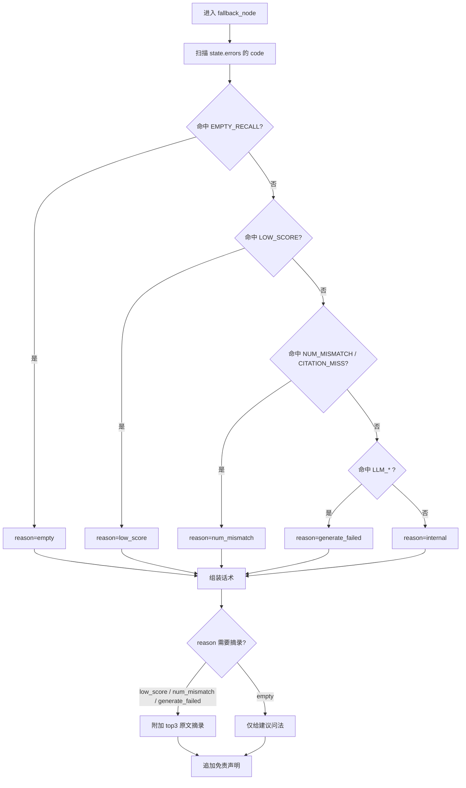

# 兜底策略

## 1. 统一原则

1. **绝不静默失败**：任何链路异常都必须产出一段对用户有用的文字；
2. **绝不在无来源时给出数字断言**：金融场景里，"编一个数字"比"说不知道"危险得多；
3. **每次兜底都给下一步**：原文摘录 / 建议问法 / 澄清选项，让用户有路可走；
4. **所有输出统一追加免责声明**："本回答基于公开财报文本自动提取，不构成投资建议。"

## 2. 五类兜底场景

| 场景 | 触发判定 | 行为 | 输出结构 |
| --- | --- | --- | --- |
| **无命中** | `fused` 为空（`E_EMPTY_RECALL`） | 明确说"未检索到"，给出可回答范围建议 | 说明 + 3 条建议问法 + 免责 |
| **低分 / 低相关** | `E_LOW_SCORE`（融合分或 IDF 相关性低于阈值） | 返回 top3 原文摘录，提示"置信度较低，请核对原文" | 说明 + 摘录（带 P 页码）+ 建议 + 免责 |
| **意图不明** | 路由 `UNCLEAR`（`confidence<0.6`） | 澄清问句 + 3 条候选问法（前端可点选） | 澄清句 + 候选 + 免责 |
| **生成失败** | `E_LLM_TIMEOUT` / `E_LLM_RATE_LIMIT` / `E_LLM_BADJSON` | 先回落 MockLLM 抽取式；仍失败则原文摘录 | "生成模型暂不可用，以下为原文摘录" + 摘录 + 免责 |
| **数值不通过** | `E_NUM_MISMATCH` / `E_CITATION_MISS`（gate 重试 1 次仍失败） | 输出含该数字的原文片段，明确"未获得可直接引用的数值" | 说明 + 摘录 + 建议 + 免责 |

场景与错误码的映射见 `src/vc/graph/nodes/fallback.py` 的 `_CODE_TO_REASON`。

## 3. 兜底判定顺序



## 4. 输出示例

**无命中**

```
未在《中国国际贸易中心股份有限公司2026年半年度报告》中检索到可靠依据（未在报告中检索到相关内容）。

你可以换一种问法，例如：
- 公司本期营业收入是多少？
- 归属于上市公司股东的净利润同比变化多少？
- 资产负债率是多少？

本回答基于公开财报文本自动提取，不构成投资建议。
```

**意图不明**

```
这个问题我还不够确定（置信度 0.42）。你想查的是哪个指标？例如：营业收入 / 净利润 / 资产负债率。

也可以直接问我：
- 公司本期营业收入是多少？
- …
```

**生成失败（含摘录）**

```
未在《…》中检索到可靠依据（生成模型暂不可用）。

以下为最相关的报告原文摘录，请核对：
- [P12] 报告期内，公司实现营业收入 1,815,972,101 元，同比减少 3.90%…
…
```

## 5. 兜底率的正确解读

评测指标里有"兜底率"，它**不是越低越好**：

- 过高（>50%）：召回能力不足或阈值过严，需要调 `MIN_TOP1_RELEVANCE` / 换更强 embedding；
- 接近 0：反而可能是防线失效——不相关的问题也被硬答了，风险更高。

健康区间建议随业务调优；当前 22 题金标集（BGE + Mock）实测**兜底率 9.1%，命中率 95.5%**：
阈值从 0.28 抬到 0.34 会把语料外诚实率从 43.3% 提到 50.0%，但金标兜底率会升到 18.2%、
引用率掉到 77.3%——权衡数据见 `docs/dev/tuning.md`。
越界题（荐股/买卖）不经过该通道，由意图路由的 `refuse_node` 拦截。

## 6. 兜底与"未找到"话术的合规边界

- 不得在兜底话术中出现任何推测性数字；
- 不得暗示"报告里应该有"；
- 建议问法必须来自 `knowledge.SUGGESTIONS` 或命中文档的真实章节，不得编造不存在的指标。
