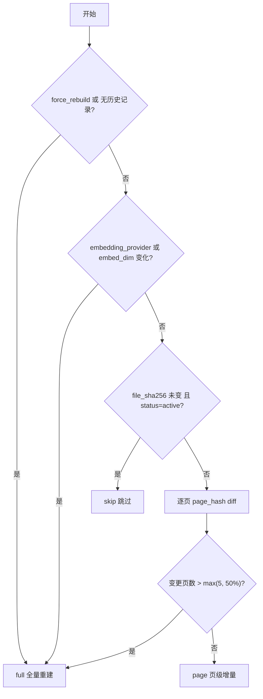

# 知识更新细则

## 1. manifest 结构

`index/manifest.json` 是知识库的"账本"，决定要不要重建、重建哪些、以及在线能读到什么。

```jsonc
{
  "version": 1,
  "updated_at": 1760000000.0,
  "docs": [
    {
      "doc_id": "4b5984b3af9e83fe",
      "path": "./data/sample_report.pdf",
      "size": 14600000,
      "mtime": 1759000000,
      "file_sha256": "…",
      "page_count": 118,
      "chunk_count": 331,
      "doc_version": "4b5984b3af9e83fe@202609181430",
      "page_hashes": ["…", "…"],          // 逐页 hash，支持页级增量
      "embedding_provider": "hashing",
      "embed_dim": 384,
      "company": "中国国际贸易中心股份有限公司",
      "stock_code": "600007",
      "report_period": "2026H1",
      "report_type": "半年报",
      "ingest_at": "2026-09-18 14:30:00",
      "prev_version": "…@202609181200",   // 用于回滚
      "status": "active"                   // active | stale
    }
  ]
}
```

`doc_version = {doc_id}@{YYYYMMDDHHMM}`，可排序、可回溯。

## 2. 增量决策树（`plan_diff`）



判断顺序说明：

1. **provider / 维度变化必须全量**——新旧向量不在同一空间，混在一起检索无意义；
2. **文件未变直接跳过**——重复入库零成本；
3. **变更页过半时全量反而更省**——页级删除本身也有开销。

## 3. 写入与原子替换

```
embed_upsert  →  build_bm25  →  write_manifest
   (写向量库       (按快照            (先写 .tmp
    + chunk 快照)   重建倒排)          + count() 校验
                                       + os.replace)
```

- **原子写**：`write_manifest_atomic` 先落 `manifest.json.tmp`，再 `os.replace` 原子替换，
  避免进程被 kill 时留下半个 JSON 让在线读到脏索引；
- **写入前校验**：`store.count() <= 0` 时直接抛错，**保留旧 manifest 继续服务**；
- **BM25 与向量库同源**：两者都基于 `index/snapshots/{doc_id}.pkl` 的同一份 chunk 快照重建，
  否则同一 `chunk_id` 在两路内容不一致会导致引用页码错位；
- **回滚**：manifest 中保留 `prev_version`，需要时可切回上一版本的快照重建索引。

## 4. 页级增量

`page` 模式下：

1. `store.delete_where({"doc_id": …, "page": {"$in": changed_pages}})` 删除变更页；
2. 该实现若不被底层支持（例如 PickleStore 的降级路径或 Chroma 版本差异），
   **自动降级为整文档替换** `store.delete_by_doc(doc_id)`；
3. 重新编码并 upsert 全部 chunk（当前实现为简化起见对整份文档重嵌，
   真正的"只编码变更页"优化点已在 `embed_upsert` 中标注）。

## 5. 失效清理

`purge_stale` 在每次入库开头执行：

- 遍历 manifest，`path` 已不存在的文档 → 从向量库删除 + 删除 chunk 快照 + 从 manifest 移除；
- 删除失败 → 标记 `status=stale`，下次入库重试，不留幽灵 chunk。

## 6. 操作手册

```bash
# 首次入库
python3 scripts/ingest.py

# 换了 PDF 后增量入库（自动判断 skip / page / full）
python3 scripts/ingest.py

# 切换 embedding provider 后必须强制全量
EMBEDDING_PROVIDER=bge python3 scripts/ingest.py --force

# 指定其它 PDF
python3 scripts/ingest.py --path ./data/another.pdf

# 查看当前 manifest
python3 -c "import json;print(json.load(open('index/manifest.json'))['docs'])"
```

## 7. 多文档语料（已落地）

语料来自交易所法定披露平台（巨潮资讯网），抓取与入库分两个入口：

```bash
# 1) 抓：按种子清单拉年报 / 半年报 PDF + 同名 sidecar 元数据
python3 scripts/crawl_reports.py                 # 全量
python3 scripts/crawl_reports.py --dry-run       # 只看命中不下载
python3 scripts/crawl_reports.py --limit 3       # 冒烟

# 2) 入库：逐文档跑入库子图，BM25 只在末尾重建一次
python3 scripts/ingest_corpus.py --dir data/reports
python3 scripts/ingest_corpus.py --dir data/reports --force   # 换 provider/dim 后必须
python3 scripts/ingest_corpus.py --rebuild-bm25-only          # 中断后的补救入口
```

### 7.1 sidecar 元数据（`*.meta.json`）

PDF 首页正则对公司/期间的抽取在真实财报上退化严重（封面格式千差万别），
因此爬虫阶段把网页侧的权威字段落到同名 JSON，入库时 `enrich_metadata` 按
**sidecar 非空即覆盖、缺失才回落正则**合并（`src/vc/ingestion/sidecar.py`）：

```
company / short_name / stock_code / exchange / industry
report_period(2024A|2025H1) / report_period_cn / report_type
announcement_title / publish_date / source_url / file_sha256
```

- 字段走白名单，公告标题里的 `<em>` 高亮标签会被清掉；
- sidecar 缺失**不阻断入库**，但打 `degraded: meta_no_sidecar:{文件名}`，便于事后排查。

### 7.2 文件命名与防重复

文件名取 `{code}_{period}.pdf`（如 `600519_2024A.pdf`），不拼公司名/公告标题：

- 同一份年报在巨潮会带"摘要/英文版/更新前"多条，稳定命名天然防重复落盘；
- manifest 的 `path` 长期不变，`purge_stale` 不会误判文档下线而删库；
- 重跑爬虫按 `_crawl_state.json`（URL→sha256）断点续传，入库侧再靠 `plan_diff` 的
  `file_sha256` 判 skip，**二次运行零重复写入**。

### 7.3 批量入库与延迟 BM25

`build_bm25` 每次都要加载此前所有文档的快照重建倒排，60 份串行是 O(n²)。
批量入库逐文档传 `skip_bm25=True`（只打标、manifest 照写，仍可断点续跑），
末尾由 `rebuild_bm25()` 统一重建一次，复杂度降为 O(n)。

### 7.4 已按多文档实现的部分

- `doc_id` 为文件路径 hash，天然支持多文件；
- `build_bm25` 读取**所有 active 文档的快照**重建；
- `metadata_recall` 支持 `stock_code / report_period / industry` 三层过滤；
- `knowledge.known_meta()` 暴露**全部**文档的 `docs` 与 `industries`，
  否则"宁德时代净利润"会因 known 里只有最后一家而抽不出 `stock_code`；
- `report_title()` 在多文档下输出不含数字的「知识库（多家上市公司定期报告）」：
  它会被拼进兜底话术并经过数值闸门，带数字会触发假阳性幻觉判定；
  公司数 / 报告数改用 `doc_count()` / `company_count()` 供 UI 展示。

后续可补：跨文档对比意图的专用召回策略（当前靠 BM25 + 行业过滤覆盖）。
