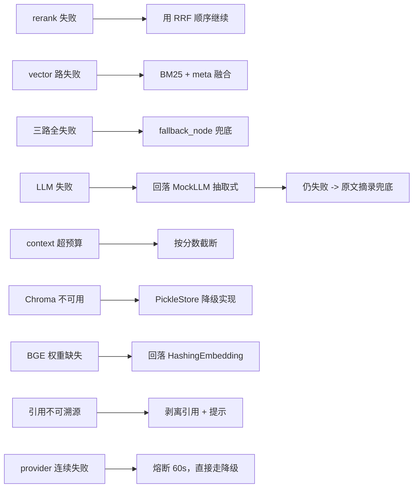

# 容错隔离与降级链

## 1. 隔离设计

**核心目标：单点失败不扩散。** 三路召回是最容易出问题的地方（外部库、索引、模型），
因此用 LangGraph 的 `Send` 做并行扇出，每路独立 try/except：

```python
def route_after_router(state):
    ...
    return [Send("bm25_recall", state), Send("vector_recall", state), Send("meta_recall", state)]
```

- 三路在同一 superstep 并发执行，**互不阻塞**；
- 每路写自己的状态键（`recall_bm25` / `recall_vector` / `recall_meta`），**互不覆盖**；
- 任一失败只把自己置空 + 写 `errors`，另外两路照常返回；
- 融合节点按"至少一路成功"原则继续，`degraded` 记录降级事实。

## 2. 部分成功判定

| 成功的路数 | 行为 |
| --- | --- |
| 3 路 | 正常融合 |
| 1~2 路 | 正常融合，写 `degraded=["bm25_recall"]` 等，前端提示"部分检索降级" |
| 0 路 | `E_EMPTY_RECALL` → `fallback_node` |

> 注意：`metadata_recall` 无过滤条件时返回空是**正常行为，不算错误**，
> 不会因为"这一路空"就误判为整体失败。

## 3. 超时预算

| 环节 | 默认 | 环境变量 |
| --- | --- | --- |
| BM25 召回 | 1.0s | `TIMEOUT_BM25` |
| 向量召回 | 3.0s | `TIMEOUT_VECTOR` |
| 重排 | 3.0s | `TIMEOUT_RERANK` |
| LLM 生成 | 30.0s | `TIMEOUT_LLM` |
| 入库加载 PDF | 30.0s | — |
| 入库 embedding+写入 | 120.0s | — |

## 4. 降级链



每一条降级都会：写 `errors`（含 `fallback` 字段说明走了哪条）+ 追加 `degraded` 标记，
最终在 API `/ask` 的 `degraded` 字段和 Streamlit 的告警条里可见。

## 5. 熔断

`CircuitBreaker` 按 **provider 维度**统计（`"llm"` / `"vectorstore"` / `"bm25"` / `"embedding"`）：

- 连续失败 ≥ `CIRCUIT_THRESHOLD`（默认 3）→ 打开；
- 打开后 `CIRCUIT_TTL`（默认 60s）内该 provider 相关节点**直接短路**返回 `fallback_patch`；
- 任意一次成功即清零计数。

目的：避免"每个问题都要等 30s 模型超时"，把故障成本从"每个请求"降到"每 60 秒一次探测"。

## 6. 组件级降级矩阵

| 组件 | 主实现 | 降级实现 | 触发条件 | 开关 |
| --- | --- | --- | --- | --- |
| 向量库 | `ChromaStore` | `PickleStore`（内存 + pickle 落盘 + 纯 Python 余弦） | chromadb 导入/初始化失败 | `VECTOR_STORE_PROVIDER=pickle` |
| BM25 | `rank_bm25.BM25Okapi` | `_SimpleBM25`（内置，k1=1.5 b=0.75） | rank_bm25 未安装 | 自动 |
| Embedding | `HashingEmbedding` | —（本身即兜底） | BGE/openai 不可用时自动回落 | `EMBEDDING_PROVIDER` |
| LLM | `OpenAICompatLLM` | `MockLLM`（抽取式） | 无 Key / 超时 / 限流 | `LLM_PROVIDER` |
| LLM 结构化输出 | `generate_json()` + JSON 模式 | 修复重试 1 次 → 回落纯文本/抽取式 | 输出不是合法 JSON 或不符合 Schema | `LLM_JSON_REPAIR`、`GENERATOR_JSON_ENABLED` |
| Rerank | `CrossEncoderReranker`（bge-reranker-base） | `HeuristicReranker` → `NoOpReranker` | 权重缺失 / torch 不可用 / 不需要精排 | `RERANK_PROVIDER=bge\|heuristic\|none` |
| Embedding | `BGEEmbedding`（512 维） | `HashingEmbedding`（384 维） | 未装 sentence-transformers 或权重下载失败 | `EMBEDDING_PROVIDER=auto\|bge\|hashing` |
| 模型权重下载 | HuggingFace | ModelScope（国内网络） | HF 不可达 | `VC_MODEL_CACHE` |
| manifest | 正常读 | 空清单（等价触发全量重建） | JSON 损坏 | 自动 |

> 维度切换的坑：Chroma 持久化集合的维度**创建时固定**，384 → 512 往同一集合 upsert 会失败。
> 因此集合名带 `provider_dim` 后缀（如 `vc_chunks__bge_512`），换模型即换空间，旧数据可回滚。

## 7. 人为注入故障的自测方法

```bash
# 1) 让向量库不可用（走 PickleStore + 三路降级）
VECTOR_STORE_PROVIDER=pickle python3 scripts/query.py "营业收入是多少？"

# 2) 让 LLM 超时（观察重试与熔断）
TIMEOUT_LLM=0.001 python3 scripts/query.py "营业收入是多少？" --trace

# 3) 清空索引后问答（观察空召回兜底）
mv index/bm25.pkl /tmp/ && python3 scripts/query.py "营业收入是多少？"

# 4) 关闭重排
RERANK_PROVIDER=none python3 scripts/query.py "营业收入是多少？"

# 5) 强制真重排模型（未装 torch 时应自动回落启发式并记 degraded）
RERANK_PROVIDER=bge python3 scripts/query.py "营业收入是多少？" --trace

# 6) 让 LLM 输出脏 JSON：观察修复重试与回落（无需 Key）
LLM_PROVIDER=fake python3 scripts/eval.py --dataset hallucination

# 7) 让向量库维度不匹配（模拟换模型未重建）
EMBEDDING_PROVIDER=hashing python3 scripts/query.py "营业收入是多少？" --trace
```
