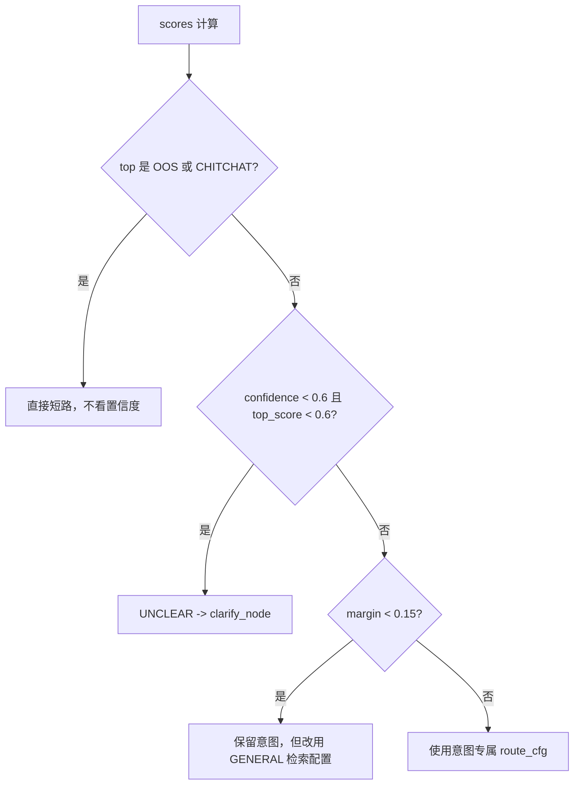

# 意图路由细则

## 1. 为什么先用规则而不是 LLM 分类

1. **Mock 阶段要能跑通**：零密钥零外网下必须能完整运行；
2. **合规红线需要可解释、可审计**：命中"买/卖/推荐/目标价"就要拒答，规则比模型更可靠、更可追溯；
3. **置信度与 margin 可直接计算**：便于做"路由不确定就退回通用配置"的降级；
4. 规则是后续 LLM 分类器的 **fallback 与标注基线**（接口已预留 `LLMClassifier`）。

## 2. 意图体系

| 意图 | 含义 | 典型问法 | 检索配置（`route_cfg`） |
| --- | --- | --- | --- |
| `METRIC` | 指标查询 | "营业收入是多少"、"资产负债率" | bm25 1.3 / vector 1.0 / meta 0.8，top_k 8，prefer_table |
| `TABLE` | 表格明细 | "主营业务构成"、"各项费用分别多少" | bm25 1.2 / vector 0.9 / meta 0.9，top_k 8，prefer_table |
| `COMPARE` | 对比类 | "同比变化"、"较上年增长多少" | bm25 1.1 / vector 1.1 / meta 0.7，prefer_table |
| `CALC` | 计算类 | "占比是多少"、"增长率" | bm25 1.2 / vector 1.0 / meta 0.7，prefer_table |
| `QUALITATIVE` | 定性分析 | "主要风险"、"为什么"、"如何看待" | bm25 0.9 / **vector 1.3** / meta 0.6，top_k 6 |
| `SUMMARY` | 摘要 | "总结一下这份报告" | bm25 0.8 / **vector 1.3** / meta 0.9，top_k 10 |
| `CHITCHAT` | 闲聊 | "你好"、"你是谁" | 不检索，直接 `direct_answer` |
| `OOS` | 越界 | "明天能买吗"、"推荐一只股票" | 不检索，直接 `refuse_node` |
| `UNCLEAR` | 不确定 | "嗯"、"那个呢" | 不检索，`clarify_node` 追问 |

设计原则：**数字类意图偏 BM25，语义类意图偏向量**——财报里的数字必须逐字命中，定性问题才需要泛化。

## 3. 打分与降级

```python
scores[intent] = weight * (1 + 0.1 * (命中次数 - 1))   # 上限 1.0
confidence = top_score / sum(all_scores)
margin     = top_score - second_score
```

规则按优先级排列，**合规红线（OOS）排在最前**，命中即短路。

降级路径：



## 4. 阈值

| 参数 | 默认值 | 环境变量 | 含义 |
| --- | --- | --- | --- |
| `intent_confidence_min` | 0.6 | `INTENT_CONFIDENCE_MIN` | 低于此值且 top 分也不高 → UNCLEAR |
| `intent_margin_min` | 0.15 | `INTENT_MARGIN_MIN` | top1 与 top2 差距过小 → 用通用配置 |

## 5. 路由后的分流（`route_after_router`）

```python
OOS      -> refuse_node     # 合规拒答
CHITCHAT -> direct_answer
UNCLEAR  -> clarify_node
其余     -> Send 并行三路召回
```

`Send` 是 LangGraph 的并行扇出：三路召回在同一 superstep 并发执行，互不阻塞，
单路失败只把自己置空并写 `errors`，不影响另外两路（详见 `resilience.md`）。

## 6. LLM 增强（已落地）与后续路径

已实现（`src/vc/graph/nodes/router.py` + `src/vc/prompts/router.py` + `src/vc/schema.py::IntentResult`）：

1. **规则优先**：合规红线（OOS/CHITCHAT）与高置信场景直接由规则决定，不下发 LLM，省延迟且可审计；
2. **LLM 只在规则犹豫时出现**：`confidence < 0.6` 或 `margin < 0.15` 时才调用 `generate_json(IntentResult)`；
3. **取严不取宽**：LLM 判 OOS 一律采纳；规则判 OOS 时 LLM 无权放行；
4. **失败即回落**：脏输出 / 超时 / 无 Key → 用规则结果，写 `degraded=["router:llm_fallback_rule"]`，链路不断。

后续路径：

1. 用线上日志沉淀高频 query → 意图标注集，定期回流优化规则权重与 few-shot；
2. 对金融垂类补充更细意图（估值类 / 分红类 / 关联交易类），并为每类定制 `route_cfg`；
3. 真 LLM 上线后统计"规则 vs LLM 分歧率"，用分歧样本微调阈值。
