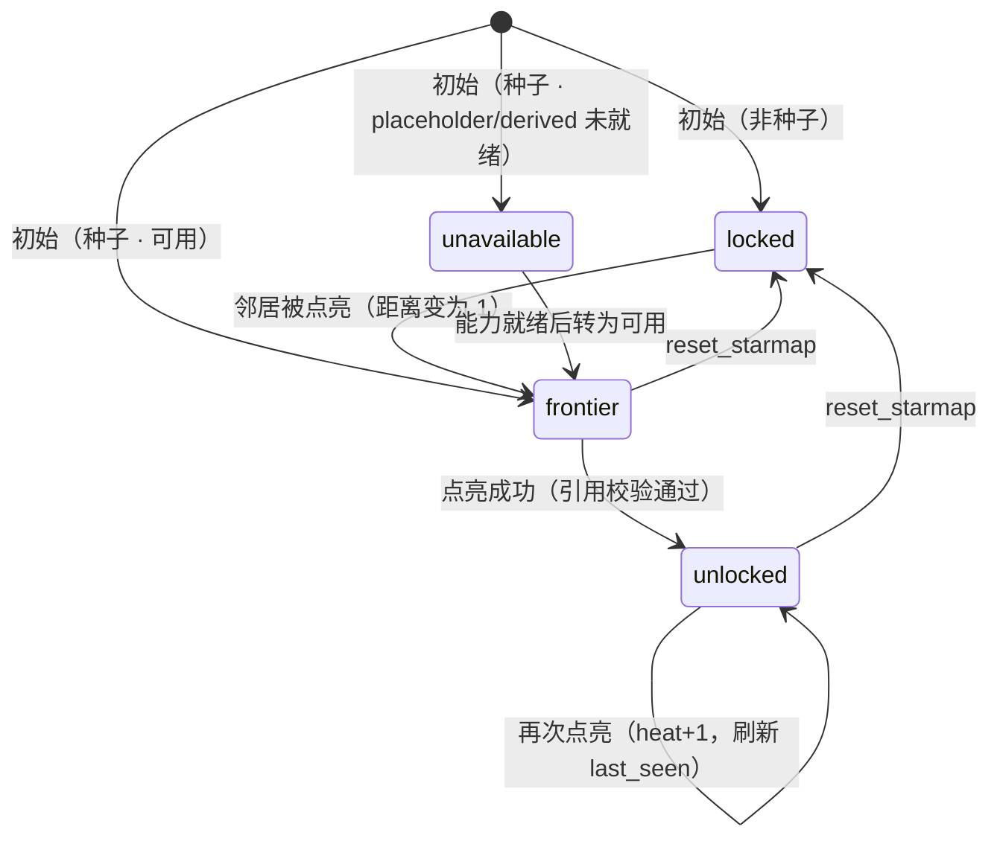

# 知识星图交互方案（v0.5）

> **状态**：草案。D1–D19 已定；三栏布局、结构化卡片四元素、交互路径与映射表、边创建机制已定。
> **性质**：本文是**交互契约**，不是实现说明。定稿后据此改代码，改代码前不改本文。
> **前置阅读**：`docs/design/nodes.md` 2.4（点亮 vs 亮度）、2.5（受控扩充）、`docs/api/rest_api.md`
>
> **v0.5 变更（漏洞修复）**：按一轮完整评审修复 23 处问题。
> ⚠️ **其中 3 处推翻了已定决策，需确认**：**D7**（探针不过不再长节点）、
> **D19**（会话边不串联 + 上限 20→5）、**禁止连到 `unavailable`**。
>
> 其余修复：分档改绝对数量锚定（修跳变/虚假差异）、pulse 改临时提档、**D16 补 `via` 信号**（否则 v1 无法实现）、
> 模式一加确认卡片、候选不排除已直连、候选提交时重新判定、冷启动拦截前置到视觉层、
> 请求补 `current_node_id`（修追问答非所问）、期间选择单入口、`thread_id` 改 `sessionStorage`（修串台）、
> `locked` 不画实体星点（修与 `unlocked(dim)` 混淆）、reset 拆分并二次确认、
> 节点 `origin` 拆为二值（边才是三值）、`reason` 判定先看 `kind`（修给出假信息）、
> 角标绑定轮次、reset 原子化、前沿锁死改为明确告知。
>
> **v0.4 变更**：`origin` 由二元扩为**三元**（D12 修订，按「谁决定了相关性」划分）；
> 新增用户显式连边机制（**D17** 两种模式 + TOP3 单选）、**D18**（连边只改可达性、不点亮）、
> **D19**（会话边纳入拓扑，第三条豁免通道）；新增 §11.4 边创建；`session_edges` 独立存储；
> 视觉编码与图例同步为三类；新增 T17–T19。
>
> **v0.3 变更**：新增三栏布局（§16）、交互路径重写为三栏视角（§10）、字段映射（§17）、
> 按钮映射（§18）、结构化卡片规格（§19）；新增 D13（亮度相对化）/ D14（对比模式）/
> D15（自然语言点亮）/ D16（文字链豁免）；契约缺口收敛为 §14.4 清单。

---

## 0. 已定决策

| # | 决策 | 结论 |
|---|---|---|
| D1 | 冷启动种子集 | **16 个**，见 §6 总表（不再是"每组首个"） |
| D2 | 自然语言是否豁免邻接限制 | **豁免** |
| D3 | 衰退是否影响可点性 | **不影响**。`unlocked` 是「读过」的事实，与亮度无关 |
| D4 | 衰退下限 | **0** |
| D5 | 熄灭态表现 | **极暗但仍在原位**（灰点，hover 可识别） |
| D6 | 衰退时间尺度 | **真实时间（wall clock）**，跨会话仍衰退 |
| D7 | 自然语言未命中且探针不过 | **长出自定义节点（弱可信）+ 给答案 + 引导相近节点** |
| D8 | 邻接边定义 | `next` 的**无向对称闭包** + 新节点与父节点的父子边 |
| **D9** | **分组体系** | **按投资语义重写为 6 组**（北极星/盈利/营运/健康/估值/定性），替换现有按报表结构的 5 组 |
| **D10** | **计算型指标** | **走路径 B：新增计算指标层**，从源科目取值 → 公式 → 结果仍可溯源到页码 |
| **D11** | **估值锚点组** | **保留但标为暂不可用**（占位，点击给「需接入行情数据」提示） |
| **D12** | **节点/边的来源维度** | **三元**：`rule` / `llm` / `user`，按「**谁决定了相关性**」划分，**用光晕颜色区分**（见 §2.2、§2.3、§15）。v0.3 的二元划分把 D7 节点误归为 `user`，本次修正为 `llm` |
| **D13** | **亮度语义** | **相对概念**：用户侧只需感知「谁比谁亮」，不追求绝对值。内部仍算数值（保留可测性），**渲染按图内排名分档**（§5.5） |
| **D14** | **对比模式** | 在**问答窗口做固定可选按钮**（粘性开关），开启后选取两期对照（§16.3、§10 P9） |
| **D15** | **自然语言点亮** | **现在做**：自然语言命中星图节点即点亮（§10 P6、§21） |
| **D16** | **文字链命中 `locked` 节点** | **豁免邻接限制**（与 D2 并列，见 §4） |
| **D17** | **用户显式连边** | 两种模式：① 指定两端（**出确认卡片**）；② 指定一端 + **LLM 出 TOP3 + 用户单选**（见 §11.4） |
| **D18** | **连边是否等于点亮** | **不等于**。只改可达性（`locked` → `frontier`），用户仍须再点一次才点亮（见 §11.4） |
| **D19** | **会话边是否参与 `clickable`** | **参与，但受限（v0.5 修订）**：路径中**最多含 1 条会话边、不串联**（`dist_G` 定义见 §4）；每会话上限 5 条。与 D2/D16 并列为第三条豁免通道，且是显式持久化的（见 §4.1） |

---

## 1. 一句话模型

> 星图是一张图上的**探索前沿**：用户的每一次点亮都把前沿向外推一格；
> 亮度是「兴趣 × 新鲜度」的函数，只影响视觉，不影响可达性。

邻接骨架不再是随意连边，而是**杜邦分解**：

```
ROE = 净利率 × 总资产周转率 × 权益乘数(1/(1−资产负债率))
⇒ roe → net_margin / asset_turnover / asset_liability
```

这条边既有金融意义，也让"从北极星往下钻"的路径天然成立。

---

## 2. 节点属性：两个正交维度

节点有两个**互相独立**的维度。定名时必须分开，否则会撞：

| 维度 | 字段 | 取值 | 回答的问题 |
|---|---|---|---|
| **取数方式** | `kind` | `native` / `derived` / `placeholder` | 这个数**怎么来的** |
| **来源** | `origin` | `rule` / `llm` / `user` | 这个节点**谁定义的**（§2.2） |

> ⚠️ **命名冲突提示**：`kind` 与 `origin` 是两个不同维度，不要合并、也不要复用同一个字段名。
> `kind` 已在 v0.1 草案中用于「取数方式」，「来源」**必须用 `origin`**，否则 `kind=native` 会被误读成"规则生成的原生节点"。

### 2.1 `kind`：取数方式

| kind | 含义 | 数量 | 链路 |
|---|---|---|---|
| `native` | 财报原文直接取数 | 24 | 现有三路召回 → 生成 → 闸门 → 引用校验 |
| `derived` | 由多个源科目**计算**得出 | 7 | **新增计算指标层**（§7） |
| `placeholder` | 需外部数据，当前不可用 | 3 | **短路**，直接返回固定卡片（§8） |

```
native      = 现有 27 个节点（其中 2 个改名）
derived     = fcf / net_margin / opex_ratio / asset_turnover / inventory_days / receivable_days / current_ratio
placeholder = pe / pb / margin_safety
总计 37 个节点
```

### 2.2 `origin`：来源（D12 · v0.5 拆为「节点二值 / 边三值」）

**划分标准：谁决定了「相关性」。**

> ⚠️ **v0.5 修订（修不一致）**：v0.4 把 `origin` 当成节点的一个三值属性，但 §11.1 的三条节点入口
> **全部产生 `llm`** —— 没有任何一条能产生 `user` 节点。于是 §2.4 的「洋红光晕」在节点上
> **永远不会出现**，图例里那一栏是死的。
> v0.5 拆开：**节点的 `origin` 是二值**（`rule` / `llm`）；**边的 `origin` 才是三值**（`rule` / `llm` / `user`）。

**节点 `origin`（二值）**：

| origin | 谁决定的 | 覆盖 | 存储 | 生命周期 |
|---|---|---|---|---|
| `rule` | **研发**（字典预置） | 37 个字典节点 | 代码常量 | 全局、随版本演进 |
| `llm` | **LLM** | LLM 提议的 `new_nodes`、引申按钮确认的节点 | `session_nodes` | **会话级**，随 `thread_id` 隔离（T4、T19） |

> v0.4 的第三条来源「D7 自然语言长出的节点」已随 D7 修订移除（§11.3：探针不过不再长节点）。

**边 `origin`（三值）**：见 §2.3。

> **v0.4 修订说明**：v0.3 把「非字典预置」一律归为 `user`，不准确 —— D7 节点的命名与归类是 LLM 给的，用户只是提了个问题。
> 本次按「谁决定了这两个节点相关」重新划分，**D7 节点与 `new_nodes` 改判为 `llm`**。
> 关键对照：**模式二归 `llm`**（相关性由 LLM 判断，用户只在候选里选了一个）；**模式一归 `user`**（用户自己说出 B）。

**两条约束**：

1. **`origin ∈ {llm, user}` 的节点只能是 `kind = native`。** 非字典节点没有预置公式，走不了计算层；若用户问的确实是需要计算的指标，要么被字典命中（→ `rule`），要么探针不过（→ `unavailable(not_disclosed)`）。
2. **`origin` 与「可信度」是两个维度**。`llm`/`user` 定义 ≠ 不可信 —— 探针通过、引用校验通过的节点就是可信的。光晕颜色只表达**出处**，不表达可信度；可信度由 §3 的状态（尤其 `unavailable`）独立表达。

### 2.3 边的 `origin`（三值）

> 节点的 `origin` 是二值（§2.2），**边的 `origin` 才是三值** —— 这是 v0.5 拆开的关键。
> 三值都可能出现，因为模式一（用户说出两端）与模式二（LLM 出候选）确实产生不同归属的边。

| 边的来源 | 数据出处 | 谁决定的相关性 | 参与 `clickable` |
|---|---|---|---|
| 规则边 | `STAR_NODES[].next` 的**无向对称闭包**（D8） | 研发 | ✅ |
| **LLM 边** | `session_edges[]` 中 `origin = "llm"` | **LLM**（模式二：LLM 出 TOP3，用户单选） | ✅（D19） |
| **用户边** | `session_edges[]` 中 `origin = "user"` | **用户**（模式一：用户明确指定两端） | ✅（D19） |

后两者统称**会话边**。距离用 §4 定义的 `dist_G`（**会话边最多用一条、不串联**）。

> **T11 已被 D17 解决**：v0.3 记录「用户定义节点只有入边（`parents`）、是叶子」。
> 用户现在可通过**显式连边**（§11.4）给它补出边。T11 因此退化为「是否要**自动**给出边」—— 建议仍不自动，交由用户显式创建。

### 2.4 四个正交的视觉维度

```
分组（6 组）          → 节点核心色 tone
origin（rule/llm/user）→ 外圈光晕色          ← D12，三值
状态（unlocked/…）    → 轮廓样式 + 亮度档位  ← D13，档位非绝对值
current               → 光晕强度 + 尺寸
```

四个维度各占一个视觉通道，互不冲突（§15）。
注意 `kind`（native/derived/placeholder）**不占视觉通道** —— 它决定节点走哪条链路，由 §3 的状态（尤其 `unavailable`）间接表达。

---

## 3. 节点状态模型

### 3.1 数据态（互斥）

| 态 | 判定 | 可点 | 点亮后 |
|---|---|---|---|
| `unlocked` | `node_id ∈ unlocked_nodes` | ✅ 无限次 | heat +1.0，刷新 last_seen |
| `frontier` | 未点亮 且 `∃u ∈ unlocked, dist(u,n) == 1` | ✅ | 同上 |
| `locked` | 未点亮 且 距离 ≥ 2 | ❌ | 拒绝 + 给下一跳建议 |
| `unavailable` | `kind == placeholder` 或 `derived` 且计算层未就绪 | ⚠️ 可 hover/点击，但**短路返回固定卡片，永不点亮** | — |

冷启动特例：`unlocked == ∅` 时，`clickable = SEED_NODES`。

> **v0.5 新增 · 对比模式下「点亮」的语义**（原未定义）：
> `unlocked` 是**节点级**概念，与期间无关。节点在两期都有数据时，**只算点亮一次，heat 恒 +1**。
> 对比模式（P9）只改变**取数范围与 `citations`**，不进入状态机。

### 3.2 `unavailable` 的 reason（决定提示文案）

| reason | 来源 | 提示文案 |
|---|---|---|
| `need_market_data` | 估值组（PE/PB/安全边际） | 「该指标需要股价/市值等行情数据，当前版本未接入」 |
| `need_metric_engine` | 计算组，计算层未就绪 | 「该指标需从多个科目计算得出，计算层未就绪」 |
| `not_disclosed` | 自然语言问的科目，探针未通过（原 weak） | 「本期报告未披露该科目」 |

**判定顺序（v0.5 新增，修「给出假信息」的 bug）**：

```
1. kind == placeholder                → need_market_data
2. kind == derived 且计算层未就绪      → need_metric_engine
3. 自然语言命中字典但探针未通过        → not_disclosed
```

> v0.4 的 §2.2 约束 1 写「用户问需要计算的指标，探针不过 → `not_disclosed`」—— 这是**错的**：
> 用户问「净利率」，探针不过（因为它需要计算而非直接披露），系统会报「本期未披露净利率」，
> 而财报明明披露了净利润和营业收入。**reason 必须是 `need_metric_engine`。**
> 判定必须先看 `kind`，再看探针。

> **为什么三条合并成一个状态**：它们的行为完全一致（可点、不点亮、不产生前沿、给固定卡片），只有文案不同。合并后状态模型只需一个 `unavailable` + `reason`，前端渲染也统一。

### 3.3 附加标记

| 标记 | 用途 |
|---|---|
| `seed` | 冷启动入口 |
| `new` | 本轮 `ui_payload.new_nodes`，渲染"刚长出来"动画 |
| `current` | `ui_payload.node_id`，单独高亮通道 |

### 3.4 状态迁移



---

## 4. 可达性：谁能点

```
clickable = unlocked
          ∪ { n | n ∉ unlocked, ∃u ∈ unlocked, dist_G(u, n) == 1 }
          ∪ (unlocked == ∅ ? SEED_NODES : ∅)
```

**`dist_G` 的定义（v0.5 修订 · D19）**：

```
dist_G(x, y) = min{ len(p) | p 是 x→y 的路径，且 p 中「会话边」的数量 ≤ 1 }
```

即：**规则边可任意串联；会话边最多用一条，且不与其他会话边串联。**

> **为什么加这条约束（修 bug）**：v0.4 直接取 union 图（会话边可自由串联）。
> 37 个节点的图里，若干条会话边串联起来足以把图直径压到 2–3 → `clickable ≈ 全部` →
> **「探索前沿」这个核心机制自我瓦解** —— 而用户有动机这么做（能连边何必一步步走）。
>
> 限制「路径中最多 1 条会话边」后：**单条边仍能推开 1 跳（功能保住），但多条边不会累加成隧道（破坏力被限住）**。
> 配合上限 5 条（§11.4），最多产生 5 个「飞地」。
>
> `next_hop_to()` 用同一个 `dist_G`。

三条硬约束：

1. **已点亮永久豁免**（D3）；
2. **`unavailable` 不参与 `clickable` 计算**：它不会撑开一片假前沿；
3. **`unlock_next` ⊆ `clickable`**。

### 4.1 三条例外（豁免邻接距离）

| 豁免 | 触发 | 理由 | 是否持久化 |
|---|---|---|---|
| **D2 自然语言** | 用户用自然语言问到的节点 | 用户明确提出的东西不该被拓扑挡住 | ❌ 单轮 |
| **D16 文字链** | 答案正文/卡片底部的文字链命中的节点，即使处于 `locked` | 答案正文**已经提到它** = 有据可查，用户点击预期应被满足 | ❌ 单轮（v1 不落库，§19.4）<br>**触发信号：`ui_filters.via = "text_link"`（v0.5 新增，否则 v1 无法实现）** |
| **D19 会话边** | 用户显式创建/确认的边（§11.4） | 用户**明确要求**的关联，比隐式豁免更可控 | ✅ **持久化**（写入 `session_edges`，影响后续所有轮次） |

> ⚠️ 豁免会让前沿机制出现"跳点"（距离 ≥2 也能点亮）。这是**有意为之**：豁免只在"用户用语言明确指向某节点"时触发，而不是任意放开。
> 豁免点亮的节点同样撑开自己的前沿（它就是新的 `unlocked`）。

> **D19 与前两条的本质区别**：D2/D16 是**隐式**的（系统推断用户意图），D19 是**显式**的（用户主动要求建边）。
> 因此 D19 持久、可撤销、可解释 —— 它是唯一一条"用户自己掌握"的豁免通道。

> **实现要点**：`clickable` **不入库，纯派生**。每次 `/ask` 返回时纯函数算一遍，零迁移成本。
> D2/D16 不进 `clickable` 集合，而是**在校验时单独放行** —— 否则豁免节点会被当成常态可点，前沿就散了。
> **D19 不同**：它直接进 `G`，因此**天然在 `clickable` 内**，无需单独放行（这正是它"显式"的体现）。

---

## 5. 亮度模型

> **D13：亮度是相对概念。** 用户侧只需感知「谁比谁亮」，不需要知道绝对值。
> 因此本节公式算出的 `brightness` 是**内部量**，用于排序与单测；**渲染一律走 §5.5 的相对分档**。

### 5.1 公式（内部量）

```
baseline(h)  = log(1 + h) / log(1 + HEAT_CAP)      # 归一化 [0,1]，log 压制刷点击
decay(Δt)    = exp(-Δt / τ)                        # Δt = now - last_seen
brightness   = baseline(heat) · decay(Δt)          # 下限 0（D4）
```

**这个数值不直接驱动渲染**。它的用途只有两个：给出图内**排序**、供单测做绝对值断言。
熄灭态（D5）不再用绝对阈值判定，改由 §5.5 的最低档表达。

### 5.2 参数（进 `CONFIG`）

| 参数 | 默认值 | 说明 |
|---|---|---|
| `HEAT_CAP` | 20 | 单节点热度上限 |
| `DECAY_TAU_DAYS` | 3.0 | 半衰期尺度（**待定 3 天 or 7 天**） |
| `VISIBLE_EPS` | 0.02 | **仅兜底**：低于此值强制按最低档（正常情况由分档决定） |
| `PULSE_DECAY_SEC` | 2.0 | 引导脉冲持续时间（超过即回落，不再连续衰减） |
| **`TIER_BRIGHT_N`** | **3** | 亮档**数量**（按 `last_seen` 最近的 N 个）—— 不用比例，见 §5.5 |
| **`TIER_DIM_N`** | **3** | 暗档**数量**（按 `last_seen` 最久的 N 个） |
| **`TIER_MIN_BRIGHTNESS`** | **0.15** | **绝对门限**（v0.5 新增）：`max(brightness)` 低于此值时**不分档**，全部渲染 `dim` |

### 5.3 引导脉冲（不落库 · v0.5 改为「临时提档」）

```
pulse_active = (now - t_recommend) < PULSE_DECAY_SEC
render_tier  = pulse_active ? min(tier + 1, "bright") : tier
```

> **v0.5 修订**：v0.4 写的是 `render_brightness = brightness + pulse`（连续量），但 §5.5 规定渲染只认
> **离散档位**，两者无合并规则，且 §5.4 要求亮度由服务端下发 —— 计算位置自相矛盾。
> 改为**档位之上的临时提升一档**（上限 `bright`），持续时间到即回落。
> 前端只需持有 `t_recommend` 时间戳，**无需服务端参与**，与 §5.4 不冲突。绝不写回 `heat`。

### 5.4 计算位置

**服务端算好下发**，前端不自己算（衰退按真实时间，前后端时钟不一致会导致亮度不同）。前端在 `visibilitychange` 与长驻页面时定时重算。

### 5.5 相对分档：渲染只看排名（D13）

> ⚠️ **v0.5 修订（修两个 bug）**：v0.4 用「按比例切档」（前 25%/后 25%），有两个致命缺陷：
> ① **跳变** —— 用户点亮 A，B 就从 `bright` 掉到 `mid`，而用户对 B 什么都没做；
> ② **虚假差异** —— 衰退按 wall clock（D6），用户一周后回来所有值都趋近 0，**但排名永远存在**，
> 必然有 25% 被标成"最近/最常看"，与事实相反。
> 根因是相对分档**没有绝对锚点**。v0.5 改为**按绝对数量锚定 + 绝对门限前置**。

服务端对当前 `unlocked` 节点分三档：

| 档位 | 取值 | 含义 |
|---|---|---|
| `bright` | 按 `last_seen` **最近的 3 个**（`TIER_BRIGHT_N`） | 最近看过的 |
| `mid` | 其余 | 一般 |
| `dim` | 按 `last_seen` **最久的 3 个**（`TIER_DIM_N`） | 很久没看（≈ 熄灭态，D5） |

**三条规则**：

1. **绝对门限前置（v0.5 新增）**：`max(brightness) < TIER_MIN_BRIGHTNESS` 时**不分档**，全部渲染 `dim`。
   堵住"所有节点都很暗、却硬有几个被标成最亮"的荒谬态。
2. **分档只按 `last_seen`，不按 `brightness` 排名**。总数增长时，只有真正的「最近 3 个 / 最久 3 个」会变，
   其他节点**永不跳档**。这是消除抖动的关键 —— 用户点亮新节点，不会导致无关节点变暗。
3. **已点亮节点 ≤ 6 个时，全部按 `mid`。** 否则 `bright` 与 `dim` 会重叠（3+3 > 6），分档自相矛盾。
   并列值按 `node_id` 字典序破平，保证同一输入的分档稳定。

**为什么这条改动必要**：分档的目的是让用户一眼看出「我最近在看什么」。
按比例切档表达的是「你在全图里的相对位置」—— 这个量会随无关操作变化，用户读不懂；
按 `last_seen` 的绝对数量表达的是「最近 3 个」—— 语义直白、稳定、且不会说谎。

**响应同时下发两个字段**：

| 字段 | 用途 |
|---|---|
| `node_brightness` | `{node_id: 0..1}` 数值，**仅供调试与单测**，前端不用于渲染 |
| `node_brightness_tier` | `{node_id: "bright"\|"mid"\|"dim"}`，**渲染只认这个** |

> **为什么这样能省心**：`HEAT_CAP` 调参、`VISIBLE_EPS` 阈值、前后端时钟漂移、甚至 τ 取 3 天还是 7 天，都**不再改变用户观感** —— 用户看到的只是"它相对变暗了"。这把 D13 从一句原则变成了可执行的工程约束。

---

## 6. 六组分类与节点总表

> ⚠️ 种子 16 个中，**只有 6 个在 v1 能真正点亮**（native）；7 个 derived 需计算层；3 个 placeholder 需行情数据。见 §9 分期。

### 组一 · 北极星指标（`tone: gold`）

| id | label | kind | 种子 | 说明 |
|---|---|---|---|---|
| `roe` | 净资产收益率 ROE | native | ✅ | 年报必披露（加权平均 ROE） |
| `fcf` | 自由现金流 FCF | derived | ✅ | 经营现金流净额 − 资本开支 |
| `eps` | 每股收益 EPS | native | | |
| `nonrecurring` | 非经常性损益 | native | | 判断 ROE 含金量 |

### 组二 · 盈利能力（`tone: gold`）

| id | label | kind | 种子 |
|---|---|---|---|
| `gross_margin` | 毛利率 | native | ✅ |
| `net_margin` | 净利率 | derived | ✅ 净利润 / 营业收入 |
| `opex_ratio` | 期间费用率 | derived | ✅ 期间费用 / 营业收入 |
| `revenue` | 营业收入 | native | |
| `net_profit` | 净利润 | native | |
| `operating_profit` | 营业利润 | native | |
| `expense_ratio` | 期间费用（绝对额） | native | |
| `rd_expense` | 研发投入 | native | |

### 组三 · 营运效率（`tone: blue`）

| id | label | kind | 种子 |
|---|---|---|---|
| `asset_turnover` | 总资产周转率 | derived | ✅ 营业收入 / 平均总资产 |
| `inventory_days` | 存货周转天数 | derived | ✅ 平均存货 × 365 / 营业成本 |
| `receivable_days` | 应收账款周转天数 | derived | ✅ 平均应收 × 365 / 营业收入 |
| `total_assets` | 总资产 | native | |
| `inventory` | 存货 | native | |
| `receivable` | 应收账款 | native | |
| `employee` | 员工情况 | native | |

### 组四 · 财务健康与防守底线（`tone: green`）

| id | label | kind | 种子 |
|---|---|---|---|
| `asset_liability` | 资产负债率 | native | ✅ |
| `current_ratio` | 流动比率 | derived | ✅ 流动资产 / 流动负债 |
| `goodwill` | 商誉 | native | ✅ |
| `cashflow` | 经营活动现金流净额 | native | |
| `capex` | 资本开支 | native | |
| `cash_balance` | 货币资金 | native | |
| `audit_opinion` | 审计意见 | native | |
| `related_party` | 关联交易 | native | |

### 组五 · 估值锚点（`tone: violet` · 新增色）

| id | label | kind | 种子 |
|---|---|---|---|
| `pe` | 市盈率 PE | placeholder | ✅ `need_market_data` |
| `pb` | 市净率 PB | placeholder | ✅ `need_market_data` |
| `margin_safety` | 安全边际 | placeholder | ✅ `need_market_data` |
| `dividend` | 分红方案 | native | 财报内唯一可得的"股东回报"指标 |

### 组六 · 定性分析（`tone: cyan` · 新增色）

| id | label | kind | 种子 |
|---|---|---|---|
| `core_competence` | 经济护城河（核心竞争力） | native | ✅ **仅改 label，不改 id/keywords** |
| `strategy` | 商业模式与经营战略 | native | ✅ **仅改 label** |
| `business_mix` | 主营业务构成 | native | |
| `industry_pattern` | 行业格局 | native | |
| `risk` | 风险因素 | native | |
| `shareholder` | 股东情况 | native | |

> **为什么护城河/商业模式只改 label 不新增 id**：「护城河」是巴菲特术语，A股年报里不会出现这个词 —— 新造 id 会被 `probe_node` 判为造词、直接丢弃。保留 `core_competence` 的 id 与 keywords（`核心竞争力/竞争优势`），只把展示名改成投资语义更强的说法。**展示层用投资语言，检索层用财报语言**，这是本方案贯穿的一条原则。

### 6.1 邻接骨架（杜邦分解为主轴）

```
roe            → net_margin, asset_turnover, asset_liability   ← 杜邦三因子
fcf            → cashflow, capex
net_margin     → net_profit, revenue
opex_ratio     → expense_ratio, revenue
asset_turnover → revenue, total_assets
inventory_days → inventory
receivable_days→ receivable
current_ratio  → cash_balance
gross_margin   → revenue, business_mix
goodwill       → risk, asset_liability
core_competence→ gross_margin, business_mix, industry_pattern
strategy       → business_mix, industry_pattern
pe / pb        → dividend
margin_safety  → pe, pb
```

组内其余节点连到本组种子。全量 `next` 表在实现时补全（现有 27 个节点的 `next` 已有定义，迁移时保留）。

---

## 7. 计算指标层（路径 B · D10）

### 7.1 为什么必须单独一层

现有链路是「检索 → 抽取 → 生成」，数字是**从文本片段里抽取**的。`净利率 = 净利润 / 营业收入` 需要先可靠拿到**两个**数值，这是现有链路做不到的。

### 7.2 三种实现粒度

| 方案 | 做法 | 溯源 | 可靠性 |
|---|---|---|---|
| B1 抽取后计算 | 两路分别召回+抽取 → 拿到两个数 → 算 | ✅ 两个源页码 | 中：两次抽取各自可能错 |
| B2 结构化取数 | 从财报主表定位标准取值 | ✅ 精确 | 高，但需先做表格解析 |
| B3 LLM 直接算 | 把两个片段一起喂给模型 | ❌ | 低，且违反 faithfulness |

**建议 B1 起步，向 B2 演进**。B1 完全复用现有链路（两次 METRIC 召回），风险最低。

### 7.3 节点定义扩展

```python
STAR_NODES["net_margin"] = {
    "label": "净利率", "keywords": ["净利润", "营业收入"], "intent": "METRIC",
    # ↓ 计算型节点专有
    "kind": "derived",
    "formula": "net_profit / revenue",
    "inputs": ["net_profit", "revenue"],
    "unit": "%",
    "next": [...],
}
```

### 7.4 四条硬约束（漏一条就会出假数据）

1. **计算必须可溯源**：结果带 `inputs: [{node_id, value, page}] + formula`，卡片上要展示"这个比率是从哪两个数算出来的"。
2. **数值闸门必须开"计算例外"** ⚠️：现有 `faithfulness_gate` 判定「数值字面量必须逐字命中 context」（`nodes.md:39`）。而**计算结果的数字必然不在原文里**（如净利率 47.2%），现行闸门会把它判为编造 → 必须新增规则：若数字可由 `formula + inputs` 复现，则放行。
3. **期间一致性**：分子分母必须来自**同一期间**。否则算出的是假的 —— 这与现有「同口径」约束（`nodes.md:212`）是同一类问题，且**数值闸门查不出来**，因为两个数在原文里都真实存在。
4. **单位统一**：净利润与营业收入都是"万元"，相除无量纲；但跨量纲运算（元 vs 万元）必须先归一。取数时必须带单位。

### 7.5 与现有链路的插入点

```
click_star(derived 节点)
  → 解析 formula.inputs
  → 并行对每个 input 走一次既有 METRIC 召回 + 抽取（复用现有链路，不改）
  → 取数结果 {value, unit, page}
  → 校验：期间一致 + 单位归一 + 数值完备
  → 计算 → 结果 + 溯源链
  → 生成卡片（含公式与输入值展示）
```

**不改**三路召回、RRF、rerank、compress；**改** `faithfulness_gate`（加计算例外）与卡片渲染。

---

## 8. `placeholder` 短路分支（D11）

`pe` / `pb` / `margin_safety` 点击时：

- **不进检索链路**，不发 LLM 请求（避免"转兜底"制造出"这家公司没披露"的假象）
- 直接返回固定卡片：`refused=true` + 「该指标需要股价/市值等行情数据，当前版本未接入」
- **不点亮**，不写 `unlocked`，不产生前沿
- 视觉：灰 + 虚线轮廓 + 锁标记

**v0.5 新增：给死路一个出口**（修「反复弹同一句话」）。

| 规则 | 说明 |
|---|---|
| **同节点同会话只弹一次完整卡片** | 之后点击只显示轻量 tooltip；提供「不再提示」选项（前端本地标记） |
| **卡片必须带行动出口** | 「看看能算的替代指标」→ 引导到 `clickable` 内的相近节点（如 PE 不可用时引导到 `dividend`） |

> 硬编码一句「当前版本未接入」就结束了，用户点三次得到三句一样的话，且没有任何下一步。
> 死路必须变成活路 —— 这是 v1 有 10 个种子点不亮时尤其重要的体验兜底。

建议落点为 `intent_router` 内加一条前置短路，或独立 `placeholder_guard` 节点。

---

## 9. 分期（重要：v1 有 10 个种子点不亮）

| 期 | 范围 | 可点亮种子 |
|---|---|---|
| **v1** | 6 组重写 + 16 种子 + 可达性 + 亮度 + `unavailable` 态 | **6 个**（roe / gross_margin / asset_liability / goodwill / core_competence / strategy） |
| **v2** | 计算指标层（§7） | +7 个（FCF / 净利率 / 费用率 / 三个周转 / 流动比率） |
| **v3** | 接入行情数据源 | +3 个（PE / PB / 安全边际） |

**v1 的体验一致性要求**：10 个不可点亮种子必须统一走 `unavailable` 态（带 reason 文案），**绝不能走 "点了没反应"**。这是 §3.2 把三种原因合并成一个状态的直接原因 —— 用户在 v1 看到的是「16 个种子，6 个亮着可点，10 个明确标注为什么暂不可用」，而不是「点了 10 个都没反应」。

---

## 10. 交互路径（三栏视角）

> 三栏：**左** = 公司财报列表（作用域 + 文档）｜**中** = 知识星图｜**右** = 对话窗口（自然语言 + 结构化卡片）

| # | 路径 | 发起栏 | 请求 | 响应消费 | 星图变化 |
|---|---|---|---|---|---|
| **P1** | 冷启动 | 左 | `GET /stats` + `GET /starmap` | 财报列表、37 节点、邻接、16 种子 | 6 个 `frontier` + 10 个 `unavailable` |
| **P2** | 选作用域 | 左 | **不发请求**（只写本地上下文） | — | 无 |
| **P3** | 点星图节点（主路径） | 中 | `click_star` + `{node_id, company, report_period}` | `ui_payload.*`、`unlocked_nodes` | 点亮 + 前沿外推 |
| **P4** | 点推荐按钮 | 右 | `click_star` + 推荐节点 id | 同 P3 | 同 P3 |
| **P5** | 点澄清按钮 | 右 | `clarify_followup` + `{node_id, …carried}` | 同 P3 | 同 P3（**当前缺失，G1**） |
| **P6** | 自然语言提问 | 右 | `natural_query` + `question` | `answer`、`citations`、**卡片** | **D15：命中即点亮**；未命中走 §11 |
| **P7** | 点文字链 | 右 | 同发起路径（点亮即 `click_star`） | — | **D16：`locked` 也放行** |
| **P8** | 点暂不可用节点 | 中 | **短路，不发请求** | `reason` 文案 | **不变**（不点亮、不产生前沿） |
| **P9** | 对比模式 | 右 | `natural_query` / `click_star` + `report_periods[]` | `citations_by_period`、`scope.report_periods` | 无（仅改变取数范围） |
| **P10** | 重置 | 中 | `reset_starmap` | `ui_payload.reset` | 回到 P1 |
| **P11** | 模式一连边 | 右 | `natural_query`（LINK 意图，含两端） | `type = link_created` / `link_failed` | 目标 `locked` → `frontier`；新增 `origin=user` 的边 |
| **P12** | 模式二连边 | 右 | `natural_query` → **`link_confirm`** | `type = link_candidates` → `link_created` | 同上，边 `origin=llm` |

**跨路径的五条通用规则**：

- **P2 是上下文不是请求**：选中公司/期间只写前端状态，随下一次 `/ask` 带上。**未选公司时前端必须拦截不发请求** —— 否则后端回 `need_company` 兜底卡片（`rewrite.py:180-184` 注入 OOS 哨兵），用户会以为系统坏了。
- **P9 是粘性开关**：开启后**所有后续请求**都携带 `report_periods`，直到用户关闭。它不是一次性动作。

以下三条为 **v0.5 新增**（修 bug）：

- **★ 冷启动：拦截必须前置到视觉层（v0.5）**。P1 之后用户还没选公司，而星图上已有 6 个 `frontier` 看起来可点 —— 点了却被拦，就是 §9 明令禁止的「点了没反应」，且发生在**用户第一次交互**。
  → **未选公司时，星图节点渲染为不可点态**（与 `locked` 同款视觉），hover 提示「先在左侧选择公司」；
  → 同时**左栏默认选中**：知识库只有 1 家公司时冷启动即选中；多家时选中最新一期报告的那家 —— 从根本上消除这个状态。
- **★ 每次请求带 `current_node_id`（v0.5）**。§17.1 规定 `history` 仅 `natural_query` 携带，于是用户点 ROE 看卡片后追问「它为什么下降」时，**后端不知道"它"指什么** → 必然答非所问。
  → 请求侧新增 `current_node_id`（最近一次交互的节点），后端注入 system prompt 作为指代消解锚点。
- **★ 期间选择只允许一个入口（v0.5）**。左栏 `report_period`（单选）与右栏对比模式 `report_periods[]`（两期）都写 `ui_filters`，v0.4 未定义优先级 → 状态冲突。
  → **对比模式开启时左栏期间选择器置灰**（显示「对比：2023 vs 2024」）；
  → 后端兜底：`report_periods[]` 非空时忽略 `report_period`，并在 `ui_payload.scope` 回显实际生效值。

---

## 11. 节点创建

### 11.1 两条入口（v0.5 由三条减为两条）

| 入口 | 触发 | 落点 | `origin`（v0.5 修订） |
|---|---|---|---|
| LLM 提议 | `click_star` 时模型在 `new_nodes` 提议 | 探针通过 → `session_nodes` + 点亮 | **`llm`** |
| 引申按钮 | 点 `ui_payload.new_nodes` 渲染的按钮 | 同上 | **`llm`** |

> **v0.5 修订**：删掉第三条入口「自然语言未命中 → 长出节点」。
> 按 §11.3（D7 修订），探针不过**不再长节点**，改由右栏直接回答 + 引导 `clickable` 内相近节点。
> 因此节点 `origin` 只剩 `rule` / `llm` 二值（§2.2）。

> 两条入口的**命名与归类都由 LLM 给出**，用户只是提了问题或点了按钮 —— 按 §2.2「谁决定了相关性」，
> 一律归 `llm`。真正的 `user` 只出现在**边**上（§11.4 模式一：用户自己说出两端）。

### 11.2 `parents` 字段（新增）

现有 `session_nodes` 无邻接信息（`generate.py:148`），新节点是孤岛 —— 点亮后没有下一跳。创建时挂 `parents:[触发节点]`。

### 11.3 探针不过时的处理（D7 · v0.5 修订）

> ⚠️ **v0.5 修订（推翻 v0.4 决策，需确认）**：v0.4 按决策「探针不过也长出节点」，
> 产出一个**永不点亮、不参与 `clickable`、越积越多**的节点 —— 即「僵尸节点」。
> 用户问「商誉减值风险」→ 星图多一个节点 → 点它 → 永远得到「本期未披露」→
> 必然被质疑「你给我长了个节点，又不让我看，那长它干嘛？」
> 且这些节点永久留在 `session_nodes`，星图外圈越来越乱。
>
> **v0.5 改为：探针不过 → 不长节点。**

| 维度 | v0.4（僵尸节点） | **v0.5（不长）** |
|---|---|---|
| 是否出现在星图 | ✅ 出现 | ❌ **不出现** |
| 是否点亮 | ❌ 永不点亮 | — |
| 会话状态污染 | 累积 `session_nodes` | **零污染** |
| 用户看到的 | 一个永远点不亮的节点 | 右栏直接答「本期报告未披露该科目」+ **引导 `clickable` 内相近节点** |

**保留的语义**：用户问的东西仍"有个交代"（右栏明确回答 + 引导），但不制造一个永远打不开的星图节点。
这与 `probe.py:86` 的原文原则一致：「当期没披露就是不能点，放进星图只会得到一张转兜底的卡片」。

> 若仍希望"留下痕迹"，替代方案是写一条**右栏历史记录**（非星图节点），或提供一个「未找到」列表入口 —— 而不是往星图里塞点不亮的节点。

### 11.4 边创建（D17）

两条入口，**均由自然语言发起**，后端识别为 **LINK 意图**。

#### 模式一 · 指定两端（`origin = "user"`）

用户明确说出 A 与 B（如「把 ROE 和商誉连起来」）：

| 步骤 | 行为 |
|---|---|
| 1 | 解析两端 → `node_id`（字典节点或会话节点） |
| 2 | 校验：非自环、非重复边、未超上限、两端均非 `unavailable` |
| 3 | **两端都命中** → 出**确认卡片**「即将连接 A ↔ B」，用户确认后才建边 |
| 4 | **仅一端命中** → 命中端固定，未命中端**复用模式二的 TOP3 补全**（不再整体失败） |
| 5 | **两端都不命中** → `link_failed` + 相近节点建议 |
| 6 | 确认后写入 `session_edges`，`origin = "user"` |

> **v0.5 修订（修 bug）**：v0.4 的模式一**无确认环节**，却要解析 2 个节点（比模式二的 1 个风险更高）。
> 解析错一个，用户看到「已连接 A ↔ B」而实际连的是别的节点，**他无从发现**；
> 且 v0.4 是「一端未命中就整体失败」，用户得把整句话重说一遍。
> 改为「确认卡片 + 部分命中补全」，两套模式的逻辑也收敛成一套。

> 为什么未命中就**不**顺带造节点：连边 + 造节点是两个动作，合并会让失败态难以解释（是边没连上，还是节点没造出来？）。见 T18。

#### 模式二 · 指定一端 + LLM 出 TOP3（`origin = "llm"`）

用户只说出 A（如「给 ROE 找相关的节点」）：

| 步骤 | 行为 |
|---|---|
| 1 | 解析源节点 A |
| 2 | LLM 基于语义相关性，从全图（37 个字典节点 + 会话节点）打分，取 **TOP3** |
| 3 | 排除**自身**；**排除 `unavailable`**（v0.5 修订，见硬约束表） |
| 4 | **已直连节点降权，不排除**（v0.5 修订）—— 排在后面并标注「已连接」，**保证 TOP3 永不为空** |
| 5 | 不足 3 个时**按实际数量给，不硬凑** |
| 6 | 下发 `ui_payload.type = "link_candidates"` + `options`（≤3 个）+ **`candidates_token`** |
| 7 | 用户**单选**（不允许多选）→ `ui_action = link_confirm` |
| 8 | **提交时后端重新判定**（见下）→ 写入 `session_edges`，**`origin = "llm"`** |

> **v0.5 修订 · 候选不再排除已直连**：v0.4 排除已直连，但冷启动时 `roe` 已连杜邦三因子（§6.1），
> **最相关的恰恰都已直连** → 候选极易枯竭甚至为 0 → 右栏无按钮，用户以为系统卡了。
> 改为**降权 + 标注「已连接」**：用户看到标注反而更清楚现状，且不会空手而归。

> **为什么模式二归 `llm`**：相关性由 LLM 判断，用户只是在候选里选了一个。
> 这与模式一（用户自己说出 B）形成对照 —— 后者才是真正的 `user`。

#### 提交时重新判定（v0.5 新增 · 修 bug）

候选基于**下发时刻**的图生成。用户可能隔很久才点，期间拓扑已变（又点亮了节点、又连了边）。直接建边会出两种 bug：目标已直连 → 幂等提示「已连接」，用户困惑「你给我的选项，点了说已连接？」；目标已点亮 → 建了一条毫无意义的边。

后端收到 `link_confirm` 时**重新判定**：

| 提交时的实际状态 | 行为 |
|---|---|
| 目标已 `unlocked` | **不建边**，直接打开该节点卡片（更贴合用户意图） |
| 目标已直连（未点亮） | 不建边，提示「已连接」，并直接点亮 / 打开 |
| 目标已变为 `unavailable` | 不建边，提示「该指标暂不可用」 |
| 其余 | 正常建边 |

> 同时校验 `candidates_token`（基于下发时刻 `session_edges` 的指纹）；不匹配则**重新出候选**，而非静默建边。

#### 复用现成组件（不新造）

`clarify.py:74` 已在产出 `{node_id, label, ui_action, ui_filters}` 结构（G1 缺口正在补这个组件）。
TOP3 候选**复用同一套 `options` 渲染与 `ui_filters` 继承逻辑**，只需新增：

- `ui_action = "link_confirm"`
- `ui_payload.type = "link_candidates"`

G1 补的澄清按钮组件一次性覆盖两个场景。

#### 状态影响（D18：连边 ≠ 点亮）

创建边**只改变可达性**，不点亮：

| 项 | 结果 |
|---|---|
| 目标节点 | `locked` → `frontier`（**可点**） |
| 是否点亮 | ❌ 用户仍需**再点一次**才真正点亮、才过 `citation_validate` |
| §3 状态模型 | **一行都不用改**，`unlocked = 读过` 的语义守住 |
| 前沿 | 目标节点撑开它自己的前沿（它就是新的 `frontier`） |

> 若「创建即点亮」，会出现「连了边就等于读过」的节点 —— 与 §11.3 刻意防掉的「已点亮却点进去没内容」是同一类问题。

#### 硬约束

| 约束 | 处理 |
|---|---|
| 自环（A ↔ A） | 禁止 |
| 重复边 | **幂等**，提示「已连接」而非报错 |
| 数量上限 | 每会话 **`MAX_SESSION_EDGES = 5`**（v0.5 修订，T17） |
| 目标是 `unavailable` | **禁止**（v0.5 修订）：候选排除 + 模式一拒绝，见下 |
| 距离缩短 | 会话边**最多用一条、不串联**（v0.5 修订，D19 修订，见 §4） |
| 方向性 | **无向**，与 D8（`next` 的无向对称闭包）一致 |
| reset | **原子清除**并**二次确认**（v0.5 新增，见下） |
| 存储位置 | 顶层 `session_edges`，**不挂在 `session_nodes[id]` 上** —— 模式一可能两端都是字典节点，无处可挂 |

> **v0.5 修订 · 禁止连到 `unavailable`**：v0.4 允许，但会产生「幽灵边」——
> v1 里这条边什么都不做（`unavailable` 不参与 `clickable`），等 v3 接入行情后**批量生效**，
> 用户早忘了自己连过，突然看到 PE 亮了还挂着一条边，无从解释。
> 改为直接禁止：连了也没用，等能力就绪后用户自然会连。

> **v0.5 修订 · 上限 20 → 5**：37 节点的图，20 条额外边足以让图直径降到 2–3，
> `clickable ≈ 全部`，「探索前沿」机制自我瓦解。5 条是「够用但不至于毁掉拓扑」的量级。

#### reset 需二次确认并拆分（v0.5 新增）

用户可能花了十几轮才建出几条边和几个节点，误点重置全没了。v0.4 的 reset 无确认、无撤销，且按钮在中栏与节点混排，误触概率高。

| 项 | 规则 |
|---|---|
| 确认弹窗 | 列出将被清除的 **N 个节点 + M 条边**，需用户确认 |
| **拆分两个选项** | ① **仅重置点亮进度**（清 `unlocked` / 热度，回到冷启动拓扑）；② **全部清除**（含 `session_nodes` + `session_edges`） |
| 默认 | **① 仅重置进度** —— 用户自己造的东西不该被一个按钮抹掉 |

---

## 12. 引导机制

| 手段 | 作用对象 | 表现 |
|---|---|---|
| 亮度脉冲 | `unlock_next` 中的节点 | 瞬时提亮后回落（§5.3） |
| 连线高亮 | 当前 → `unlock_next` | 发光 + 粒子流向目标 |
| 路径提示 | `locked` 被 hover | 「需先点亮「营业收入」」+ 高亮路径 |
| 能力提示 | `unavailable` 被 hover | 「需接入行情数据」/「计算层未就绪」（按 reason） |
| 相机行为 | 点亮瞬间 | 缓动聚焦 |

---

## 13. 边界与异常

| 场景 | 处理 |
|---|---|
| **前沿锁死** | 放开「距离=2 中 heat 最高的 1 个」，但**必须明确告知**「已无可探索的相邻指标，为你开放了「X」」（v0.5：不再静默放开）；或引导用自然语言（豁免通道） |
| **新节点孤岛** | `parents` 字段解决 |
| **切换公司/期间** | heat/last_seen 不重置；`session_nodes` 建议带 `scope` 标过期（待定 T4）；**`session_edges` 同样需带 `scope`** |
| **多标签串台** | `thread_id` 隔离，**前端存 `sessionStorage`**（v0.5 修订）—— localStorage 是同源共享的，两个标签页会读到同一个 `thread_id`，**恰恰导致串台** |
| **并发重复点击** | `merge_unique` 去重 + `merge_heat` 累加 |
| **heat 溢出** | 封顶 `HEAT_CAP = 20` |
| **长驻页面亮度僵住** | 前端定时重算 + `visibilitychange` 重算 |
| **v1 点 derived/placeholder** | 短路，不发 LLM，明确给原因（§9）；**同节点只弹一次完整卡片 + 必须带行动出口**（§8） |
| **连边目标为 `unavailable`** | **禁止创建**（v0.5 修订）：候选排除 + 模式一拒绝，理由见 §11.4「幽灵边」 |
| **模式一节点未命中** | **部分命中则补全，不整体失败**（v0.5 修订）：命中端固定，未命中端用 TOP3 补全；两端都不命中才 `link_failed` |
| **会话边超限** | 提示已达上限（5 条）并说明原因：「继续创建会让星图失去探索层次」（§11.4） |
| **对比模式下点亮** | `unlocked` 是**节点级**、与期间无关，heat 恒 +1；对比模式只影响取数范围与 `citations`（§3.1） |
| **会话边超限 / 自环 / 重复** | 分别返回上限提示 / 拒绝 / 幂等提示「已连接」（§11.4） |

---

## 14. 契约变更

### 14.1 State 新增字段

| 字段 | 类型 | reducer |
|---|---|---|
| `node_last_seen` | `Dict[str, float]` | 覆盖式（新值胜） |
| `session_nodes[id].parents` | `List[str]` | 随 `merge_nodes` |
| `session_nodes[id].kind` | `str` | 随 `merge_nodes` |
| `session_nodes[id].origin` | `str` | 默认 **`"llm"`**（D12 修订；仅 `link` 模式一下的显式指定才能产生 `"user"`），随 `merge_nodes` |
| **`session_edges`** | `List[{from, to, origin, created_at}]` | 新增顶层字段，与 `session_nodes` **平级**；`merge_unique` + 按 `(from,to)` 幂等 |

`node_heat` **语义与 reducer 均不变**（继续只累加），衰退靠 `last_seen` 现算。

> **为什么边不能挂在 `session_nodes[id].edges` 上**：模式一可能两端都是字典节点（如 `roe` ↔ `goodwill`），
> 无处可挂。必须与 `session_nodes` **平级**独立存储（§11.4）。

> `origin` 只存在 `session_nodes` / `session_edges` 上；字典节点的 `origin` 由前端默认 `rule`，**不入库**。

**reset 必须是原子操作（v0.5 新增）**：T3 清 `session_nodes`、§11.4 清 `session_edges`，若只清其中一个会留下**悬空引用**（`parents` 指向已被清掉的边）。

```
reset_starmap 原子清除：unlocked_nodes + node_heat + node_last_seen + session_nodes + session_edges
```

且需**二次确认并拆分两个选项**（§11.4）：默认仅重置点亮进度，全量清除为第二选项。

### 14.1.1 `ui_action` 白名单扩充

`src/vc/ui.py` 的 `UI_ACTIONS` 元组新增一项，并纳入 G6 的 422 校验白名单：

| action | 含义 | 携带参数 |
|---|---|---|
| **`link_confirm`** | 模式二：用户在 TOP3 候选中**单选**后确认创建边（§11.4） | `{node_id, link_from, …carried}` |

现有四项不变：`click_star` / `natural_query` / `clarify_followup` / `reset_starmap`。

### 14.2 `GET /starmap`（新增）

```jsonc
{
  "seeds": ["roe", "gross_margin", "asset_liability", "goodwill", "core_competence", "strategy"],
  "groups": [{"name": "北极星指标", "tone": "gold", "ids": [...]}],
  "nodes": {
    "roe":       {"label": "净资产收益率", "kind": "native", "origin": "rule", "intent": "METRIC"},
    "net_margin":{"label": "净利率", "kind": "derived", "origin": "rule",
                  "formula": "net_profit / revenue", "inputs": ["net_profit","revenue"], "unit": "%"},
    "pe":        {"label": "市盈率", "kind": "placeholder", "origin": "rule",
                  "reason": "need_market_data"}
  },
  "adjacency": {"roe": ["net_margin", "asset_turnover", "asset_liability"]},
  "session_edges": [
    {"from": "roe", "to": "goodwill", "origin": "user", "created_at": 1769500000}
  ]
}
```

> 规则边仍在 `adjacency`；`session_edges` 只下发**会话边**（`origin ∈ {llm, user}`）。
> 字典节点 `origin` 恒为 `rule`，可不下发（前端默认 `rule`）；**只需下发 `origin ≠ rule` 的节点与会话边**。

### 14.3 `POST /ask` 新增返回字段

| 字段 | 说明 |
|---|---|
| `clickable_nodes` | 当前可点节点 id 列表 |
| `node_states` | `{node_id: "unlocked"\|"frontier"\|"locked"\|"unavailable"}` |
| `unavailable_reasons` | `{node_id: "need_market_data"\|"need_metric_engine"\|"not_disclosed"}` |
| `node_brightness` | `{node_id: 0..1}`，服务端现算。**仅供调试与单测，前端不用于渲染**（D13） |
| `node_brightness_tier` | `{node_id: "bright"\|"mid"\|"dim"}`，**渲染只认这个**（§5.5） |
| `ui_payload.blocked_by` | `locked` 被 hover 时的最短路径下一跳（基于 **union(规则边, 会话边)** 的图，D19） |
| `ui_payload.calc_trace` | 计算型节点专有：`{formula, inputs:[{node,value,page}], result}` |
| `ui_payload.type` | 新增取值 `"link_candidates"` / `"link_created"` / `"link_failed"`（§11.4） |
| `ui_payload.options` | TOP3 候选时携带，复用现有结构，`ui_action = "link_confirm"`（§11.4） |
| `session_edges` | 创建后回传**全量**会话边，前端据此重算距离（D19） |

### 14.4 契约缺口清单（实现前必须先补）

| # | 缺口 | 位置 | 处理 |
|---|---|---|---|
| **G3** | `rest_api.md` 未记录 8 个字段 | `docs/api/rest_api.md:117-126` | 补记：`citations_by_period` / `degraded_reason` / `type` / `options` / `prompt` / `reset` / `new_nodes` / `suggestions` |
| **H1** | `citation` 未回填 `chunk_id` | `validate.py:29-38`（类型已在 `state.py:136` 声明） | 补一行；供片段高亮定位（§19.3） |
| **H6** | `/stats.docs[]` 字段不足 | `apps/api.py:58` | 补 `short_name` / `report_type` / `page_count` / `doc_id` |
| **G6** | `ui_action` 未校验，拼错静默落 `natural_query` | `apps/api.py:39` | 按 `UI_ACTIONS` 白名单校验，非法值回 **422** |
| **G7** | 无 `/starmap` 接口 | `apps/api.py` 路由表 | 新增（结构见 §14.2） |
| **G1** | `ui_payload.options` 三个澄清按钮前端从未渲染 | `clarify.py:74` vs `streamlit_app.py:251-315` | 右栏补澄清按钮（§16.3、§18） |
| **G2** | 自然语言不点亮 | `rewrite.py:49-53` | D15 修复：改 `rewrite.py`，命中才设 `star_node_id` |

### 14.5 契约已声明但不建组件的字段

`industry` / `section_keywords` / `prefer_table` / `prefer_period` / `stock_code` / `suggestions`

> **结论：保留契约兼容，不建 UI。** 它们或是内部软偏好（`prefer_*`），或由其他字段归一而来（`stock_code` 由 `company` 归一），或尚未有产品位置（`industry`、`suggestions`）。
> `compare` 与 `report_periods` 因 D14 已转为对比模式组件（§16.3），**不在此列**。

---

## 15. 渲染映射（3D 星图）

### 15.1 视觉通道分配（四个维度互不冲突）

| 维度 | 通道 | 取值 |
|---|---|---|
| **分组** | 节点**核心色** | 6 个 tone |
| **来源 `origin`** | 节点=**外圈光晕**（仅色相，二值）；边=**线型**（三值） | 节点：`rule`=冷白 / `llm`=琥珀；边：实线 / 琥珀长虚线 / 洋红点线 |
| **状态** | 轮廓样式 + 亮度 | 实线 / 虚线 / 灰 |
| **当前节点** | 光晕**强度 + 尺寸** | — |

> 光晕的**色相**表来源、**强度**表状态 —— 同一元素承载两个维度但不冲突：洋红光晕变亮仍是洋红。

### 15.2 来源编码（D12 · 三值）

**节点光晕（二值，v0.5 修订）** —— 节点 `origin` 只有 `rule` / `llm` 两值（§2.2）：

| origin | 光晕色 | 说明 |
|---|---|---|
| `rule` 规则生成 | `--glow-rule:#CFE3FF`（冷白银） | 研发预置，稳定、可预期 |
| `llm` LLM 判断 | `--glow-llm:#FFA94D`（琥珀橙） | AI 提议/长出的节点，会话结束可能消失 |

> **去掉「环形态」这一维**：两值用两个色相足够，且 v0.4 的「单环实线 vs 单环虚线」在 3D 小尺寸下**根本看不出来**。
> 去掉后视觉通道从 5 个降到 4 个（缓解过载），环形态这个通道留给状态（§15.3）。

**边线（三值）**：见下方「边上同样区分」。

**为什么边必须「色相 + 线型」双编码**（v0.5 修订）：

1. 洋红与估值组的 `violet #8B5CF6` 色相接近，单靠颜色在 3D 里容易混；
2. 色觉障碍用户靠线型也能区分（冗余编码）；
3. 线型差异在小尺寸/远处也能看清，颜色会被光晕淹没。

> 注：**节点光晕不再用环形态**（只有两值，两个色相足够；且虚线环在 3D 小尺寸下看不出来，见 §15.3）。
> 双编码只保留在**边**上。

**边上同样区分**（颜色 + 线型双编码）：

| 边 | 表现 |
|---|---|
| 规则边 | **实线**，沿两端节点 tone 渐变 |
| **LLM 边** | **琥珀橙长虚线** + 流向粒子的粒子也是琥珀橙 |
| 用户边 | **洋红点线** + 流向粒子的粒子也是洋红 |

### 15.3 状态 × 来源 叠加后的效果

> 亮度列一律用**档位**（D13），不直接用 `brightness` 数值。

| 数据态 | 亮度档位 | 尺寸 | 轮廓 | hover |
|---|---|---|---|---|
| `locked` | — | 最小 | **不画实体星点**，只画轨道上的**空位刻度** | ❌ |
| `frontier` | `dim` + 引导脉冲 | 中 | 实线细边 | 节点名 |
| `unlocked`（`bright`） | `bright` | 中大 | 实线金边 | 「再次点开」 |
| `unlocked`（`mid`） | `mid` | 中 | 实线 | 「再次点开」 |
| `unlocked`（`dim`） | `dim` ≈ 熄灭态（D5） | 小 | **实线灰边** | 「曾点亮，可再次点开」 |
| `unavailable` | `dim` | 中 | **虚线 + 锁标记** | 按 reason 给原因 |
| `current` | 最高 | 最大 | 强光晕 | — |

> 上表的**轮廓/亮度**与 15.2 的**光晕**叠加生效：
> 例如「LLM 长出的、已点亮、当前节点」= 琥珀橙光晕 + 实线金边 + 最大尺寸 + 强光晕；
> 「用户自己连的边」= 洋红点线；「研发预置的边」= tone 渐变实线。

> ⚠️ **v0.5 修订 · `locked` 不再画成灰点（修「分不清看过 vs 没解锁」）**：
> v0.4 里 `locked` 与 `unlocked(dim)` **视觉几乎相同**（都是暗灰），只能靠 hover 区分，
> 而两者**后续行为完全相反**（一个点不动、一个可以点开）—— 这是可点击性的严重缺失。
> 3D 小尺寸下 hover 前根本无法分辨，用户必然质疑「这个灰点是我看过的还是没解锁的？」
>
> → `locked` **不画实体星点**，只渲染为轨道上的**空位/刻度**（暗区里的一个位置标记）；
> → `unlocked(dim)` 仍是**实心但低亮度**的星点。
> 「有没有这个点」和「这个点亮不亮」是两个通道，任何距离下都能区分。

> **v0.5 修订 · 光晕不再用「环形态」区分**（缓解视觉通道过载）：
> 节点 `origin` 已改为二值（§2.2），两个色相足够，**去掉单环实线/单环虚线的区分**
> （3D 小尺寸下虚线环根本看不出来）。边上仍用线型（实线/琥珀长虚线/洋红点线）区分三值。

### 15.4 布局

**三栏（§16）**：左栏固定宽（财报列表）、中栏弹性（星图，占主视觉）、右栏固定宽（对话）。
窄屏（< 1280px）时左栏折叠为顶部下拉，右栏改为中栏下方抽屉 —— 星图**始终可见**，因为它是主视觉。

**中栏星图内部**：
- **6 条旋臂 = 6 个分组**（北极星最靠内 → 定性分析最靠外）
- **`origin ∈ {llm, user}` 的节点在外圈独立区域**，不与字典节点混排 —— 位置再叠一层来源区分，与光晕颜色形成双重确认

新增 tone：`--violet:#8B5CF6`（估值）、`--cyan:#22D3EE`（定性）；
新增光晕色：`--glow-rule:#CFE3FF`、`--glow-user:#FF4FD8`。

### 15.5 图例（必做）

四个维度都有视觉编码，**必须提供图例**，否则用户读不懂：

- 分组色条（6 色 + 组名）
- **节点来源图例（v0.5 改为两类）**：冷白光晕 = 系统预置 / 琥珀橙光晕 = AI 找出来的
- **边线图例（三类）**：tone 渐变实线 = 预设关联 / 琥珀橙长虚线 = AI 找到的关联 / 洋红点线 = 我连的
- 状态图例（实线 = 可点 / 虚线 = 暂不可用 / **空位刻度 = 未解锁** / 灰实心 = 曾点亮）
  - ⚠️ 必须把「未解锁」和「曾点亮但暗了」画成**不同形态**（空位 vs 实心灰点），否则用户分不清

### 15.6 降级与可访问性

| 条件 | 降级 |
|---|---|
| 无 WebGL | 中栏降级为**按分组的 37 个节点列表**（DOM 按钮）—— 这同时就是可访问性兜底 |
| `prefers-reduced-motion` | 关自转与粒子流，只保留静态星图 |
| 切后台（`visibilitychange`） | 暂停 RAF |
| 键盘 | 星图节点用 DOM 覆盖层做 label + hit-test，Tab 可达 |
| 屏幕阅读器 | 提供节点列表视图 + ARIA；**图例文本化**（不能只靠颜色） |

> 图例（§15.5）+ 本节降级是**必做项**：四个维度都靠视觉编码表达，没有任何文本兜底的话，色觉障碍用户完全读不懂星图。

---

## 16. 可交互组件清单（三栏）

> 三栏：**左** = 公司财报列表｜**中** = 知识星图｜**右** = 对话窗口。
> 状态三态：**现有**（Streamlit 已有，可直接迁移）／**缺失**（契约已声明或已决策，但前端从未实现）／**不迁移**（Streamlit 调试参数，不是产品组件）。

### 16.1 左栏 · 公司财报列表

| 组件 | 交互 | 写入字段 | 数据源 | 状态 |
|---|---|---|---|---|
| 财报卡片列表 | 展示 | — | `GET /stats.docs[]` | 现有（侧栏初版，需扩字段） |
| 选中公司 | click | `ui_filters.company` | 同上 | 现有 |
| 选中报告期 | select | `ui_filters.report_period` | 同上 | 现有 |
| 落盘一致性徽标 | 只读 | — | `/stats.index_verify` | 现有（建议迁移） |

> **缺口 H6**：`/stats.docs[]` 目前只透出 6 个字段（company / stock_code / report_period / chunk_count / doc_version / status，`apps/api.py:58`）。做成能看的列表至少补 `short_name` / `report_type` / `page_count` / `doc_id`。

### 16.2 中栏 · 知识星图

| 组件 | 交互 | 触发动作 | 状态 |
|---|---|---|---|
| 字典节点（37 个） | click / hover | `click_star` | 现有 |
| 会话新节点 | click | `click_star` | 现有 |
| 重置 | click | `reset_starmap` | 现有 |
| `locked` 节点 | hover | 不发请求 | **缺失**（需新增 `blocked_by`） |
| `unavailable` 节点 | hover / click | 短路，无请求 | **缺失** |

### 16.3 右栏 · 对话窗口

| 组件 | 交互 | 触发动作 | 状态 |
|---|---|---|---|
| 输入框 | submit | `natural_query` | 现有 |
| 示例问题按钮 | click | `natural_query` | 现有 |
| **对比模式开关** | toggle | 粘性携带 `report_periods` / `compare` | **缺失（D14）** |
| 结构化卡片 | 展示 | — | **缺失（§19）** |
| 文字链（正文内联 + 卡片底部） | click | 走发起路径 | **缺失** |
| **澄清选项按钮** | click | `clarify_followup` | **缺失（G1）** |
| **连边候选按钮（TOP3 单选）** | click（**单选**） | **`link_confirm`** | **缺失（D17）**，复用澄清按钮组件（§11.4） |
| 推荐点亮按钮 | click | `click_star` | 现有 |
| 引用角标 `[Pxx]` | click | — 定位片段高亮 | 现有（**需补 `chunk_id`，H1**） |
| 降级 / 兜底 chip | 只读 | — | 现有 |
| Trace 时间线 | 只读 | — | 现有 |
| 召回片段抽屉 | 只读 | — | 现有 |

### 16.4 建议不迁移（Streamlit 调试参数）

`top_k_final` 滑块、`min_top1_relevance` 滑块、`rerank_provider` 单选 —— 这三项是**调参工具**，不是产品组件。误当产品组件会让用户以为"调了就能得到更好的答案"，实际会绕过闸门设计。建议移入独立调试面板。

### 16.5 契约已声明但不建组件

`industry` / `section_keywords` / `prefer_table` / `prefer_period` / `stock_code` / `suggestions` —— **保留契约兼容，不建 UI**。

> `compare` 与 `report_periods` 因 D14 已转为有组件（§16.3），**不在此列**。

---

## 17. 字段映射

### 17.1 请求侧：组件 → 字段

```
question       ← 右栏输入框 / 示例问题按钮        （仅 natural_query，max 500）
history        ← 前端维护的问答历史               （仅 natural_query）
ui_action      ← 中栏 / 右栏按钮
ui_filters     ← 左栏作用域 ⊕ 被点节点 node_id ⊕ 对比模式
thread_id      ← sessionStorage，首次生成          （v0.5：不用 localStorage，见 §13）
current_node_id ← 最近一次交互的节点               （v0.5 新增，指代消解锚点，见 §10）
```

| `ui_filters` 字段 | 由哪个组件写入 | 说明 |
|---|---|---|
| `company` | 左栏选中公司 | **必填**，未选时前端拦截；**左栏需默认选中一家**（§10） |
| `report_period` | 左栏选中报告期 | 显式指定 → 硬过滤；**对比模式开启时该选择器置灰**（v0.5） |
| `report_periods[]` | 右栏对比模式开关 | 最多 2 期，去重保序；非空时后端忽略 `report_period` |
| `compare` | 右栏对比模式开关 | 不指定哪两期时后端补「最新 + 去年同期」 |
| `node_id` | 中栏节点 / 右栏按钮 | 定位节点 |
| `linked_nodes[]` | 右栏文字链（**预留**） | v2 落真实热度时启用，见 §19.4 |
| `link_from` | 右栏连边候选按钮（`link_confirm`） | 模式二源节点；与 `node_id`（目标）配对，见 §11.4 |
| **`via`**（v0.5 新增） | 右栏文字链 | 取值 `"text_link"`；**D16 豁免的唯一触发信号**，见 §19.4 |
| **`candidates_token`**（v0.5 新增） | 右栏连边候选按钮 | 回传下发时的候选指纹，供后端校验拓扑是否已变，见 §11.4 |

### 17.2 响应侧：字段 → 消费组件

| 响应字段 | 消费组件（栏） |
|---|---|
| `ui_payload.explanation` / `.label` | 卡片正文 / 标题（右） |
| `ui_payload.citations` | 引用角标（右） |
| `ui_payload.citations_by_period` | 对比模式引用（右） |
| `ui_payload.scope` | 卡片副标题「公司 + 期间」（右） |
| `ui_payload.unlock_next` | 推荐按钮（右）+ 星图脉冲（中） |
| `ui_payload.new_nodes` | 会话新节点（中）+ 新发现 chip（右） |
| `ui_payload.refused` / `degraded_reason` | 拒绝态（右） |
| `ui_payload.options` | **澄清按钮（右）** |
| `ui_payload.reset` | 星图全量重渲染（中） |
| `unlocked_nodes` | 已点亮态（中） |
| `node_states` | 节点状态（中） |
| `node_brightness_tier` | 亮度档位渲染（中） |
| `node_brightness` | **仅调试 / 单测，不渲染** |
| `degraded[]` / `fallback_reason` | 降级 / 兜底 chip（右） |
| `trace[]` | Trace 时间线（右） |
| `fusion_stats` | 检索明细（右） |
| `citations[]` / `context[]` | 召回片段抽屉（右） |

---

## 18. 按钮映射

| 按钮 | 所在栏 | `ui_action` | 携带参数 | 前置条件 | 后置变化 |
|---|---|---|---|---|---|
| 星图节点 | 中 | `click_star` | `{node_id, company, report_period}` | 已选公司 | 点亮 + 前沿外推 |
| 会话新节点 | 中 | `click_star` | 同上 | 同上 | 同上 |
| 重置 | 中 | `reset_starmap` | `{}` | 无 | 清空，回 P1 |
| 推荐点亮 | 右 | `click_star` | 同上 | `node_id ∈ unlock_next` | 同上 |
| **澄清选项** | 右 | `clarify_followup` | `{node_id, …carried}` | `ui_payload.type == "clarify"` | 点亮 + 前沿外推 |
| **连边候选（单选）** | 右 | **`link_confirm`** | `{node_id, link_from, …carried}` | `ui_payload.type == "link_candidates"` | 创建边；目标 `locked` → `frontier`，**不点亮**（D18）；边 `origin="llm"` |
| **文字链** | 右 | 同发起路径 | `{node_id, …}` | 命中术语表 | **D16：`locked` 也放行** |
| 对比模式开关 | 右 | 不单独发请求 | `report_periods[]` / `compare` | 无 | 粘性携带至后续所有请求 |
| 示例问题 | 右 | `natural_query` | `{question}` | 无 | 问答轮次（D15 命中则点亮） |
| 引用角标 | 右 | 不请求 | — | 有 `chunk_id` | 滚动定位 + 片段高亮 |

> **G5**：推荐按钮与星图节点按钮复用同一个 `click_star`，后端**无法区分**「主动探索」与「顺推荐点击」。建议新增 `ui_source` 字段（仅影响埋点，不影响功能）。

---

## 19. 结构化卡片规格（右栏）

卡片是右栏对话窗口的输出形态，由四个元素组成。

### 19.1 专有名词释义

**v1：前端维护静态术语表，做静态匹配。**

术语条目**从一开始就用对象结构**（不用 `term → node_id` 扁平映射），为 v2 接入知识基座留位：

```ts
interface GlossaryEntry {
  term: string;
  aliases: string[];
  node_id: string;              // 命中时用于星图亮度增强
  definition: string;
  priority?: number;            // 同义词冲突时取优先级高者
  source: {
    kind: "manual" | "book";    // v1 恒为 manual；v2 = 理论书籍精读产出
    book?: string;
    chapter?: string;
    page?: string;
    confidence?: number;
  };
}

interface GlossaryProvider {
  load(): Promise<GlossaryEntry[]>;
  match(text: string): GlossaryEntry[];   // 最长匹配优先；同一轮内同 node_id 去重
}
```

- **v1**：`GlossaryProvider` 实现为前端本地 `glossary.json`，全部 `source.kind = "manual"`
- **v2**：换成 `GET /glossary`，条目由理论书籍精读产出，`source.kind = "book"`
- **前端渲染代码两版都不用改** —— 这就是"提前留好接口"的落点

有了 `source.kind`，UI 可直接显示「释义来源：《xxx》P123」，把人工释义与书籍产出区分开。

### 19.2 计算公式

仅 `kind = derived` 的节点有。展示 `{formula, inputs:[{node, value, page}], result}`（契约字段 `ui_payload.calc_trace`）。

⚠️ **v1 不会真正出现**（计算层是 v2）。但卡片模板要预留，且必须满足 §7.4 四条硬约束 —— 尤其**数值闸门要开"计算例外"**，否则计算结果会被判成编造。

### 19.3 文档链接

**点击行为：定位到本文档内的片段高亮**（不跳外链、不跳原 PDF）。

> **缺口 H1**：`Citation` 类型**已声明 `chunk_id`**（`state.py:136`），但 `citation_validate`（`validate.py:29-38`）只填了 `page` / `doc_id` / `section_path` / `snippet`，**没填 `chunk_id`**。需补一行。
>
> 注意 `snippet` 是 `clip(..., 160)` 截断的，高亮需基于 `chunk_id` 做**前缀匹配**，不要拿 160 字去全文精确匹配。

> **v0.5 新增 · 角标必须绑定所属轮次**（修「多轮后找不到片段」）：
> 右栏有多轮消息、每轮各有引用角标。若召回抽屉是全局的，多轮后会被塞满，点旧轮次的 `[P12]` 找不到对应片段。
> → 角标**绑定到所属的消息轮次**，点击时展开**该轮次的内联片段**（而非全局抽屉）；
> → 若仍用抽屉，则**按轮次分组 + 自动滚动定位**到目标片段。

### 19.4 引导文字链

**两个位置**：答案正文内联 + 卡片底部一行。

**命中星图节点时该节点亮度增强**，机制与间接节点相同（`HEAT_INDIRECT = 0.5`，`unlock.py:23`）。

两条硬规则：

1. **必须去重（H3）**。间接热度只对 `unlock_next` 记一次且排除已点亮，不会重复；但文字链在**同一轮答案里可能命中多次、多轮还会反复命中** —— 不去重的话，刷几轮问答就能把某个节点刷到最亮，热度模型直接失效。
   → **同一轮内同一 `node_id` 只记一次**；跨轮只记首次出现或设上限。
2. **v1 走不落库的视觉脉冲（H4）**。术语匹配发生在**前端**，而亮度由**服务端**算好下发（§5.4）—— 后端无从知晓命中了哪些节点，算不了热度。
   → v1 复用 §5.3 的 pulse 机制，只做视觉增强，**不写 `node_heat`**（刷新即消失，零后端改动）；
   → v2 术语匹配移到后端后，前端通过预留的 `ui_filters.linked_nodes[]` 回传命中列表，再落真实热度。

**D16**：文字链命中 `locked` 节点时**豁免邻接限制** —— 答案正文已经提到它，即视为有据可查。

> ⚠️ **v0.5 修订（D16 在 v1 原本无法实现）**：豁免需要后端在校验时放行，但 v1 术语匹配发生在**前端**，
> 且 `linked_nodes[]` 是 v2 预留字段 —— **后端拿不到"这次点击来自文字链"这个信号，无法放行**，
> D16 在 v0.4 里是一句空头承诺：用户点文字链指向的 `locked` 节点，会被正常拒绝。
>
> **修法**：点文字链时前端在 `ui_filters` 带 **`via = "text_link"`**（v0.5 新增字段，§17.1）。
> 后端见到即走豁免分支。成本接近零，v1 可做，且顺带把待定项 T13（`ui_source`）一起定掉。

---

## 20. 待定项

| # | 议题 | 建议 |
|---|---|---|
| T1 | 半衰期 τ 取 3 天还是 7 天 | 3 天 |
| T2 | `derived` 在 v1 是标 `unavailable` 还是直接不显示 | **标 `unavailable`（带原因）**，否则用户以为系统漏了 |
| T3 | reset 是否清 `session_nodes` | 清 |
| T4 | `session_nodes` 是否带 `scope` | 带 |
| T5 | **H 批次：视觉稿映射** | 待你提供效果图后填 §15 |
| T6 | 自然语言 → node_id 命中阈值 | ≥ 0.5（与探针同口径） |
| T7 | 应急前沿（hop=2 放开 1 个）是否要 | 要 |
| **T8** | **计算层取数方案 B1 还是 B2** | B1 起步 |
| **T9** | **数值闸门"计算例外"怎么判定复现** | 用 inputs 重算结果并比对浮点误差 ≤ 0.5% |
| **T10** | **v1 是否要隐藏 unavailable 种子的"可点"外观** | 建议保留可 hover（给原因），但不给脉冲引导 |
| **T11** | **是否要给用户节点"自动"补出边**（当前只有 `parents` 入边） | **D17 已提供显式通道**（§11.4 连边），故不再阻塞；建议仍**不自动**补，交由用户显式创建 |
| **T12** | **会话节点（`origin ∈ {llm, user}`）切换公司/期间后怎么处理** | 建议标过期（灰化 + 「该节点属于 XX 公司」），与 T4 的 `scope` 一起定；**会话边同理**（`session_edges` 也需带 `scope`） |
| **T13** | **推荐点击要不要加 `ui_source` 区分埋点**（G5） | 加。只影响埋点，不影响功能 |
| **T14** | **文字链热度跨轮怎么记**（H3 的去重口径） | 只记**首次出现**；或按轮次递减（第 n 轮记 `0.5/n`） |
| **T15** | **v1 术语表覆盖范围** | 先覆盖 37 个字典节点 + 常见别名；会话新节点不建词条 |
| **T16** | **对比模式最多几期** | 2 期（`clean_ui_filters` 已硬限 `ps[:2]`）；要放开需先改卡片模板 |
| **T17** | **每会话会话边数量上限** | **5 条**（v0.5 由 20 下调）。37 节点的图里 20 条足以让 `clickable ≈ 全部`，前沿机制瓦解 |
| **T18** | **模式一节点未命中时是否顺带造节点** | **不造**。先给相近节点建议，保持失败态可解释（§11.4） |
| **T19** | **`session_edges` 是否随 `thread_id` 隔离** | 是（与 `session_nodes` 一致，见 T4） |

> **D13 后 T1 的优先级下降**：τ 取 3 天还是 7 天，现在只影响**相对顺序**，不再改变观感（§5.5）。可以晚点定。

---

## 21. 落地清单（定稿后执行）

| 文件 | 改动 | 对应 |
|---|---|---|
| `src/vc/ui.py` | **重写 `STAR_GROUPS`（5→6 组）**、扩 `STAR_NODES`（+10 节点、加 `kind`/`formula`/`inputs`）、重建邻接、新增 `SEED_NODES`(16)、`compute_clickable()`、`node_brightness()`、`node_brightness_tier()`、`next_hop_to()`、`match_node_by_query()`；**`UI_ACTIONS` 扩充 `link_confirm`**；**`clean_ui_filters` 加 `link_from` / `via` / `candidates_token` 白名单**；**`compute_clickable()` / `next_hop_to()` 改用 §4 的 `dist_G`（会话边最多 1 条、不串联）**；**分档函数改为按 `last_seen` 绝对数量 + 绝对门限** | D9/D10/D13/D15/D17/D19 |
| `src/vc/metrics/`（新增） | 计算指标层：公式求值、取数编排、单位归一、期间一致性校验 | D10 |
| `src/vc/graph/nodes/gate.py` | 数值闸门加"计算例外" | §7.4-2 |
| `src/vc/graph/nodes/router.py` | `placeholder` 前置短路 | §8 |
| `src/vc/graph/nodes/rewrite.py` | **自然语言 → node_id 规则映射，命中才设 `star_node_id`**（不再无条件清空）；**新增 LINK 意图识别**（模式一含两端 / 模式二仅一端） | D15/G2/D17 |
| `src/vc/graph/nodes/validate.py` | **citation 回填 `chunk_id`** | H1 / §19.3 |
| `src/vc/state.py` | `node_last_seen` + reducer；`session_nodes` 补 `parents`/`kind`/`origin`；**新增顶层 `session_edges` 字段 + reducer**（按 `(from,to)` 幂等） | §14.1 / D17 |
| `src/vc/graph/nodes/unlock.py` | 写 `last_seen`；邻接校验 + `blocked_by`（基于 union 图）；**D2/D16 豁免单独放行**（D19 直接进 `G`，无需放行） | §4.1 / D19 |
| `src/vc/graph/nodes/generate.py` | 新节点挂 `parents` + 标 **`origin:"llm"`**（D12 修订，原为 `user`）；`unlock_next` 与 `clickable` 取交集；产出 `link_candidates` payload | §11 / §18 / D17 |
| **`src/vc/graph/nodes/link.py`（新增）** | 边创建：解析两端（模式一**出确认卡片**、部分命中用 TOP3 补全）、**LLM 取 TOP3**（模式二，已直连降权不排除、排除 `unavailable`）、**提交时重新判定**（已点亮→直接打开 / 已直连→提示并打开 / 校验 `candidates_token`）、校验自环/重复/**上限 5 条**、写 `session_edges`；产出 `link_candidates` / `link_created` / `link_failed` | D17 / D18 |
| `src/vc/config.py` | 亮度/衰退/**分档**参数：**`TIER_BRIGHT_N` / `TIER_DIM_N` / `TIER_MIN_BRIGHTNESS`**（v0.5 由 `TIER_BRIGHT_PCT` / `TIER_DIM_PCT` 改为绝对数量 + 绝对门限）、`MAX_SESSION_EDGES = 5` | §5.2 / §11.4 |
| `apps/api.py` | `GET /starmap`（§14.2）；`/ask` 补返回字段；**`/stats.docs[]` 扩 4 字段**；**`ui_action` 按 `UI_ACTIONS` 校验回 422** | G7/H6/G6 |
| 前端 · 布局 | **三栏**：左财报列表 / 中星图 / 右对话窗口 | §16 |
| 前端 · 中栏 | 6 组渲染 + `unavailable` 态 + **节点光晕两类**（§15.2，去掉环形态）+ **边线三类**（实线/琥珀长虚线/洋红点线）+ 图例（§15.5）+ **`locked` 画为轨道空位刻度而非灰点** + 分档渲染 | §15 / D12 / D19 |
| 前端 · 右栏 | 结构化卡片四元素（§19）、**对比模式开关**（D14）、**澄清按钮**（G1）、**文字链（带 `via="text_link"`）**（D16）、**连边候选按钮（TOP3 单选）**（D17，复用澄清按钮组件）、**`unavailable` 卡片带行动出口 + 同节点只弹一次** | §19 / §11.4 / §8 |
| **前端 · 通用（v0.5 新增）** | **`thread_id` 存 `sessionStorage`**（不存 localStorage）；**每次请求带 `current_node_id`**；**左栏默认选中一家公司**；**未选公司时中栏节点渲染为不可点态**；**对比模式开启时左栏期间选择器置灰**；**reset 二次确认弹窗（拆分两个选项）**；**引用角标绑定所属轮次** | §13 / §10 / §17.1 / §19.3 |
| 前端 · 术语表 | `GlossaryProvider` 接口 + v1 本地 `glossary.json`（`source.kind="manual"`） | §19.1 |
| `tests/` | 分组覆盖断言（现有 `test_star_groups_cover_every_node_exactly_once` 需同步更新）、邻接对称性、种子可用性、衰退单调性、`unavailable` 不点亮、`origin` 字段不丢、**会话边不混进规则边**、**分档在节点数 ≤6 时全为 `mid`**、**文字链同轮去重**；
**v0.5 新增断言**：① 分档**不跳变** —— 点亮新节点后，无关节点的档位不变；
② **绝对门限** —— 所有 `brightness` 极低时全部为 `dim`，不得出现 `bright`；
③ **pulse 提档**不超过 `bright` 且不写回 `heat`；
④ **`dist_G` 不串联** —— 路径含 2 条会话边时不计入距离；⑤ 会话边上限 5 生效；
⑥ 候选**永不为空**（已直连降权不排除）、**排除 `unavailable`**；
⑦ **`link_confirm` 提交时重新判定** —— 目标已点亮时不建边而是打开卡片；
⑧ 模式一**部分命中补全**而非整体失败；
⑨ **`reason` 判定先看 `kind`** —— `derived` 探针不过必须报 `need_metric_engine` 而非 `not_disclosed`；
⑩ reset **原子清除**五类状态；
⑪ **`via="text_link"` 触发 D16 放行**；
⑫ 探针不过**不产生 `session_nodes`** | §5.5 / H3 / §11.4 / §4 |
| 文档 | 同步 `nodes.md` 2.4、`docs/api/rest_api.md`（补 8 个字段，G3）、README 文档地图、补 ADR | §14.4 |

---

## 附：与现有实现的关系

**不改**：`probe_node` 判据、三路召回与 RRF、降级链与兜底话术、合规红线。

**改**：

- 分组体系 5→6 组、节点表 27→37（D9/D10/D11）
- 新增计算指标层（D10，v2）
- 新增 `unavailable` 短路与 reason（§3.2、§8）
- 可达性与亮度两个正交维度；亮度改**相对分档**（D13）
- 新增 `origin` 来源维度及其视觉编码，**v0.4 由二元改三元**（D12 修订，D7 节点与 `new_nodes` 改判 `llm`）
- 新增用户显式连边机制（D17）、连边只改可达性（D18）、会话边纳入拓扑（D19）
- 新增顶层状态字段 `session_edges`（§14.1）与 `ui_action = link_confirm`（§14.1.1）
- 新增对比模式（D14）、自然语言点亮（D15）、文字链豁免（D16）
- `citation_validate` **补填 `chunk_id`**（H1）—— 只加字段，不改校验逻辑
- `rewrite.py` 自然语言分支改为「先映射再决定」（G2/D15）
