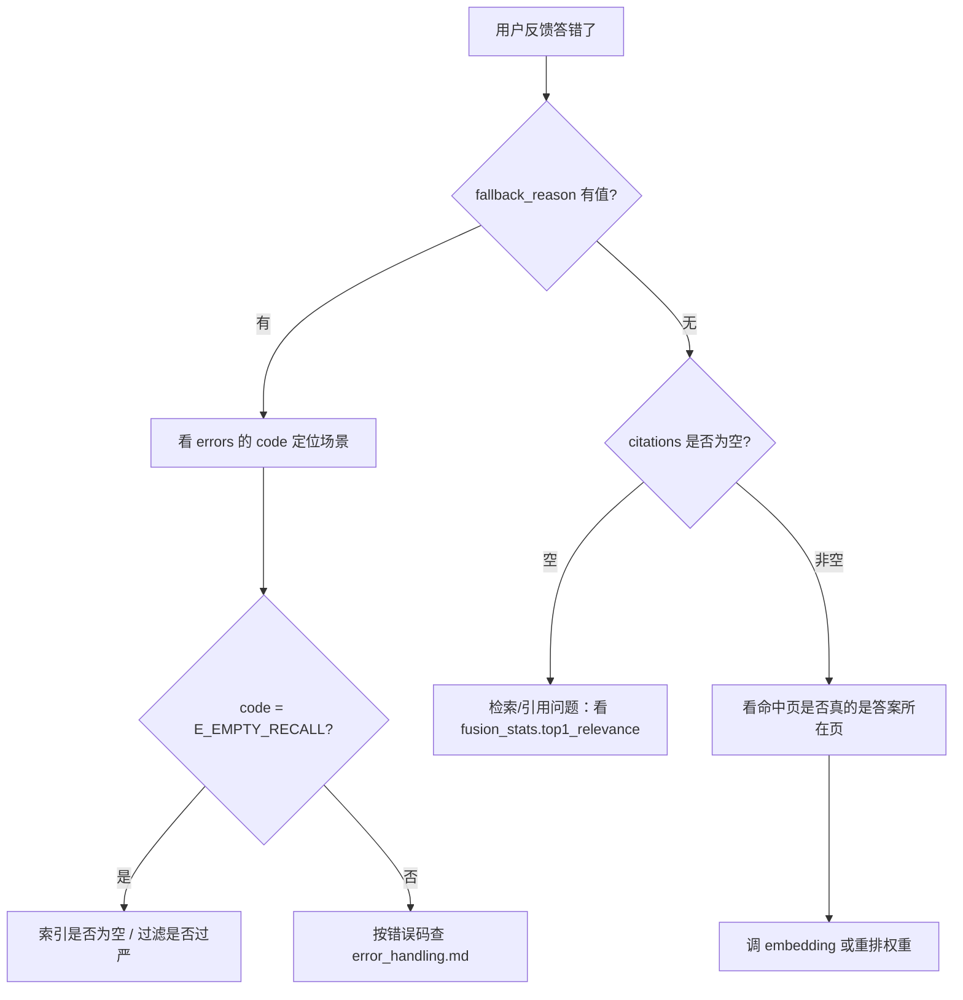

# 可观测性

## 1. 三层观测

| 层 | 载体 | 用途 |
| --- | --- | --- |
| 节点级 | `state["trace"]`（add_list 累加） | 每次请求的节点耗时与成败 |
| 请求级 | `state["trace_id"]` | 串联一次问答的所有日志 |
| 运行级 | 结构化 JSON 日志（stdout） | 离线分析与告警 |

## 2. trace 记录

每个节点由 `safe_node` 自动写入一条：

```jsonc
{
  "node": "vector_recall",
  "latency_ms": 42.13,
  "ok": true,
  "error_code": "",        // 失败时为 ErrorCode 值
  "degraded": "",          // 如 "vector_recall_fallback"
  "ts": 1760000000.0
}
```

失败记录的 `error_code` 与 `state["errors"]` 中的 `code` 一一对应。

## 3. 日志格式

单行 JSON，字段：`event / ts / node / latency_ms / ok / error_code / degraded`。

```bash
python3 scripts/query.py "营业收入是多少？" 2>&1 | grep '"event":"node"'
```

## 4. 关键字段速查

| 字段 | 位置 | 含义 |
| --- | --- | --- |
| `errors` | `/ask` 响应 | 错误流水，含 code/node/retryable/severity |
| `degraded` | `/ask` 响应 | 已启用的降级项（如 `rerank`、`vector_recall`、`llm:fallback_to_mock`） |
| `fusion_stats` | `/ask` 响应 | `count` / `top1_score` / `top1_relevance` / `relevant` / `table_hits` / `pages` |
| `intent` + `intent_confidence` | `/ask` 响应 | 路由结果与置信度 |
| `fallback_reason` | `/ask` 响应 | `empty` / `low_score` / `num_mismatch` / `generate_failed` / `internal` / `oos` / `clarify` / `chitchat` |

## 5. 排查路径



## 6. 脱敏要求

- 日志中禁止出现：API Key、Authorization 头、chunk 正文全文；
- 需要展示文本时用 `summarize_text(text, limit=80)` 或 `clip(text, n)`；
- `/ingest` 接口默认关闭，开启时必须带 `X-Token`。
